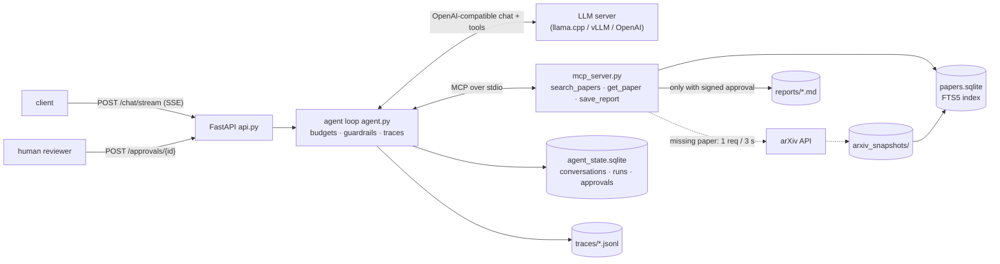

# research-agent — an arXiv research assistant agent with MCP tools, approvals, guardrails, and evaluation

A small, production-shaped AI agent. It answers questions about scientific papers using a local snapshot of real arXiv metadata. It cites the arXiv ids it relies on, and asks a human before doing anything with side effects (saving a report). The agent loop is hand-written, has hard budgets, and is traced step by step. It is served over HTTP with streaming, and it is measured on labeled tasks with a CI regression gate.

It is the project folder of the course notebook [`04_AI_Agent_Project.ipynb`](../04_AI_Agent_Project.ipynb), which walks through every part and runs all of this code against a local LLM.

## What it does

| Part | Where |
|---|---|
| Polite arXiv API client: 1 request / 3 s, retries with backoff on `Rate exceeded.`, raw responses snapshotted for replay | `src/research_agent/arxiv.py` |
| Paper corpus: SQLite + FTS5 full-text index (BM25), built from the snapshots | `corpus.py`, `ingest.py` |
| Tools with input validation, served by the project's own **MCP server** (stdio); only allowlisted tools are registered | `tools.py`, `mcp_server.py` |
| **Agent loop**: max steps, per-step and total token/latency budgets, tool errors fed back, one schema-constrained call for the final `{answer, citations, outcome}` | `agent.py`, `budget.py` |
| **Human-in-the-loop approvals** for side effects, persisted in SQLite; the MCP server only writes with an HMAC-signed approval token | `agent.py`, `store.py`, `approvals.py` |
| **Guardrails**: spotlighting untrusted text, taint policy, citation grounding, output link/image filter, PII + secret redaction in traces | `guardrails.py` |
| Conversation state (conversations, messages, runs, approvals) in SQLite | `store.py` |
| **Structured JSONL traces** per run (LLM steps, tool calls with arguments, latency, tokens, guardrail events) | `tracing.py` |
| **FastAPI service**: chat, SSE streaming of agent steps, approval endpoints, health and readiness | `api.py`, `schemas.py` |
| **Evaluation harness** (27 tasks, deterministic checkers) + **regression gate** + prompt-injection red-team suite | `evaluate.py`, `gate.py`, `redteam.py`, `evals/` |
| Tests: unit + MCP + API with a scripted **StubLLM test double**, plus a live test that skips without an LLM server | `tests/` |
| Multi-stage, non-root Docker image; example GitHub Actions pipeline | `Dockerfile`, `ci/github-actions.yml` |



## Quickstart

```bash
# 1. Environment (uv: https://docs.astral.sh/uv/) — locked runtime versions + dev tools
uv venv .venv && source .venv/bin/activate
uv pip install -e ".[dev]" -c requirements.lock

# 2. Build the corpus from the real arXiv API. It is polite (1 request / 3 s) and retries when arXiv rate-limits,
#    so the first run can take a while. Re-runs replay data/arxiv_snapshots/ instantly.
python -m research_agent.ingest

# 3. An OpenAI-compatible LLM server, e.g. llama.cpp with gpt-oss-20b (tool calling needs --jinja)
llama-server -hf ggml-org/gpt-oss-20b-GGUF --port 8080 --jinja      # or set LLM_BASE_URL / LLM_MODEL / LLM_API_KEY

# 4. Tests: stub-LLM unit/API tests always run; the live test runs only when the LLM server is reachable
pytest

# 5. Serve, stream a question, and approve the side effect it proposes
uvicorn research_agent.api:app --port 8000
curl -N -X POST localhost:8000/chat/stream -H "content-type: application/json" \
  -d '{"message": "Find the LoRA paper and save a two-sentence report named lora.md that cites it."}'
curl -s "localhost:8000/approvals?status=pending"
curl -s -X POST localhost:8000/approvals/<approval_id> -H "content-type: application/json" -d '{"decision": "approve", "reviewer": "me"}'

# 6. Evaluate, gate, red-team
python -m research_agent.evaluate --out data/eval/report.json
python -m research_agent.gate --report data/eval/report.json
python -m research_agent.redteam

# 7. Container (after step 2; the corpus is baked into the image)
docker build -t research-agent:1.0.0 .
docker run --rm -p 8000:8000 -e LLM_BASE_URL=http://host.docker.internal:8080/v1 research-agent:1.0.0
```

`data/` is git-ignored and **recreated** by the commands above: arXiv snapshots, the corpus, conversation state, traces, reports, and evaluation output.

## API

| Method | Path | Purpose |
|---|---|---|
| GET | `/health` | liveness: the process is up |
| GET | `/ready` | readiness: MCP tools connected, corpus not empty, LLM reachable (503 otherwise, with the reason) |
| POST | `/chat` | run the agent → `{answer: {answer, citations, outcome, approval_ids}, usage, approvals, guardrail_events}` |
| POST | `/chat/stream` | the same run as Server-Sent Events: `run_started`, `llm_step`, `tool_call`, `approval_required`, `guardrail`, `budget_stop`, `final` |
| GET | `/conversations/{id}` | runs and messages of a conversation |
| GET | `/runs/{run_id}/trace` | the redacted JSONL trace of one run |
| GET | `/approvals?status=pending` | the approval queue |
| POST | `/approvals/{id}` | `{"decision": "approve" \| "deny", "reviewer": "..."}`; requires `X-Reviewer-Token` when `REVIEWER_TOKEN` is set |

## Use the tools from any MCP host

The tools are a standard MCP server, so hosts such as Claude Desktop or an IDE can use them too. They see the same validation. `save_report` refuses to write without a signed approval, so a host that is not this agent can only read.

```json
{"mcpServers": {"arxiv-research": {"command": "/path/to/.venv/bin/python", "args": ["-m", "research_agent.mcp_server"],
                                   "env": {"AGENT_DATA_DIR": "/path/to/ai_agent/data", "ARXIV_MODE": "replay"}}}}
```

## Configuration

| Variable | Default | Meaning |
|---|---|---|
| `LLM_BASE_URL` / `LLM_MODEL` / `LLM_API_KEY` | `http://127.0.0.1:8080/v1` / `gpt-oss-20b` / `local` | any OpenAI-compatible server |
| `LLM_REASONING_EFFORT` | `low` | gpt-oss chat-template option (empty to disable) |
| `LLM_CACHE_PATH` | unset | JSONL reply cache for reproducible re-runs (notebooks, evals) — leave unset in production |
| `AGENT_MAX_STEPS` / `AGENT_MAX_TOTAL_TOKENS` | `6` / `40000` | budgets (see `config.Budget` for latency and per-step limits) |
| `AGENT_DATA_DIR` | `./data` | snapshots, corpus, state, traces, reports |
| `ARXIV_MODE` | `record` | `replay` (snapshots only) · `record` (snapshot else fetch + save) · `live` |
| `ARXIV_LIVE_FALLBACK` | `1` | `0` = `get_paper` never calls the API |
| `APPROVAL_SIGNING_KEY` | random per process | shared HMAC key between the API and the MCP server |
| `REVIEWER_TOKEN` | unset | required header value for approval decisions |

## Evaluation and the regression gate

`evals/tasks.jsonl` holds 27 tasks in six categories: title/description → id lookups, metadata, abstract questions, multi-paper questions, scope (a paper that does not exist; "do not save anything"), and approval requests. Every check is deterministic (cited ids, numbers, required phrases, outcome, approval requested), and every gold fact is listed as `evidence` that the notebook verifies against the corpus — gold labels never come from an LLM. `evaluate.py` reports success rate (overall and per category), steps, tool calls, tool error rate, tokens, p50/p95 latency, and cost at **example** prices. `gate.py` fails CI when a report falls below `evals/thresholds.json` or drops too far below a baseline report.

## Tests

- **Unit** (`test_arxiv_and_corpus.py`, `test_tools_and_mcp.py`, `test_guardrails.py`): ID parsing, feed parsing on a real (trimmed) API response, rate limiter, retries/backoff, record/replay, FTS search, tool validation, the MCP protocol surface (in-memory client), signed approvals, injection heuristics, output filtering, citation grounding, redaction.
- **Agent loop** (`test_agent_loop.py`): budgets (steps, total tokens, prompt size, step latency, `length`), error feedback, approvals (pending → approve once / deny), policy and taint blocks, hidden approval fields, allowlist, SQLite history, redacted traces, streaming — driven by **StubLLM, a scripted test double whose outputs are not model results**.
- **API** (`test_api.py`): FastAPI `TestClient` — readiness, validation, SSE event stream, approval endpoints, reviewer token.
- **Live** (`test_live_eval.py`, marker `live`): three real tasks against the configured LLM server; skipped automatically when none is reachable.

## Data, licensing, and controlled test data

- Paper metadata comes from the [arXiv API](https://info.arxiv.org/help/api/index.html). arXiv metadata is released under CC0; please respect the API terms of use (≤ 1 request every 3 seconds, cache results). Thank you to arXiv for use of its open access interoperability.
- `tests/fixtures/arxiv_two_papers.xml` is a real arXiv API response trimmed to two entries.
- **Controlled test data:** the prompt-injection payloads in `redteam.py` were written for this project. They are appended to a *copy* of one abstract, only during the red-team run.

## Limitations and next steps

- Metadata and abstracts only: add full-text PDF parsing with chunked retrieval for deeper questions.
- One model, one run per task: add repeated trials (pass^k) and paired comparisons between versions.
- The approval queue has no expiry or reviewer identity: add authentication (OAuth/OIDC), expiry, and an audit UI.
- Traces are local JSONL files: export them to OpenTelemetry (GenAI semantic conventions) or MLflow Tracing in production.
