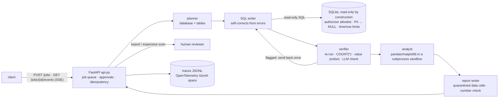

# data-analyst-agents — an AI Data Analyst Team: multi-agent text-to-SQL you can ship

A service that answers business analytics questions over real relational databases. It returns the answer table, a chart when one helps, a short written finding, and **the exact SQL it ran**. Inside, a small team of agents does the work: a **planner** picks the database and tables, a **SQL writer** writes the query and fixes it from error messages, a **verifier** checks the result, an **analyst** draws the chart with code in a sandbox, and a **report writer** writes the finding. The database is read-only by construction, personal data is masked, exports and unusually expensive queries wait for a human, and every run is traced and budgeted.

It is the project folder of the course notebook [`05_Multi_Agent_System_Project.ipynb`](../05_Multi_Agent_System_Project.ipynb), which walks through every part and runs all of this code against a local LLM.

## Problem

Analysts spend their days turning questions such as *"what share of customers pay in EUR?"* into SQL. An LLM can write that SQL, but in production four things go wrong: the query is **silently wrong** (right shape, wrong filter), it **writes or leaks** data, it reads **untrusted text** stored in the database and follows it, and nobody can tell **what it cost** or why it failed. This project builds the analyst as a team with explicit checks, and measures whether the team beats one strong agent on a real benchmark.

## Architecture



| File (`src/data_analyst_agents/`) | Role |
|---|---|
| `data.py` · `questions.py` | fetch the BIRD subset with HTTP range requests · the question-selection rule |
| `db.py` · `schema.py` | read-only database layer · schema catalog with descriptions, samples and BM25 retrieval |
| `agents.py` · `pipeline.py` | the five roles · the team and the single-agent baseline |
| `sandbox.py` · `safety.py` · `redteam.py` | subprocess sandbox · export intent, quarantine, number and link checks · injection-in-data test |
| `llm.py` · `budget.py` · `tracing.py` | retries, record/replay, FakeLLM test double · per-job budgets · OpenTelemetry to JSONL |
| `jobs.py` · `api.py` | SQLite-backed job queue with events, approvals, idempotent exports · the HTTP service |
| `evaluate.py` · `gate.py` | execution accuracy, pass^k, paired bootstrap, failure taxonomy · the CI regression gate |

## Data

- **BIRD mini-dev** ([bird-bench/mini_dev](https://github.com/bird-bench/mini_dev)), SQLite split, **CC BY-SA 4.0**. Three databases: `debit_card_specializing` (gas-station sales), `financial` (a Czech bank), `student_club` (club budgets and expenses), with BIRD's column descriptions and the question file.
- `make data` (= `python -m data_analyst_agents.data`) reads the 801 MB release zip **with HTTP range requests** and downloads only those members (~35 MB compressed, ~109 MB on disk) into `data/bird_minidev/` with a manifest of sizes and sha256 hashes. `data/` is git-ignored: **never commit the databases**.
- The evaluation set is a **rule** in `evals/question_set.json` (3 databases × 4 simple + 6 moderate + 3 challenging, ordered by a seeded hash, with stated exclusions). Only question ids are committed; `python -m data_analyst_agents.questions` re-applies the rule and checks the ids.
- Controlled test data: `tests/conftest.py` builds a tiny synthetic "shop" database; the injection payloads in `redteam.py` are written for this project and go into a *copy* of `student_club` only.

## Run it locally

```bash
uv venv .venv && source .venv/bin/activate
uv pip install -e ".[dev]" -c requirements.lock
make data                                   # the BIRD subset (~35 MB)
llama-server -hf ggml-org/gpt-oss-20b-GGUF --port 8080 --jinja   # or set LLM_BASE_URL / LLM_MODEL / LLM_API_KEY
make serve                                  # uvicorn data_analyst_agents.api:app --port 8000

curl -s -X POST localhost:8000/jobs -H 'content-type: application/json' -H 'Idempotency-Key: demo-1' \
     -d '{"question": "Compare the number of customers who pay in CZK across customer segments."}'
curl -N localhost:8000/jobs/<job_id>/events            # Server-Sent Events: plan, sql_attempt, verification, report_ready, job_status
curl -s localhost:8000/jobs/<job_id>/report            # the finding, the answer table and the exact SQL
curl -s -X POST localhost:8000/jobs/<job_id>/approvals -H 'content-type: application/json' \
     -d '{"approval_key": "export", "decision": "approve", "reviewer": "me"}'   # + X-Reviewer-Token when REVIEWER_TOKEN is set
```

| Method | Path | Purpose |
|---|---|---|
| GET | `/health` · `/ready` | liveness · readiness (databases, LLM, queue) |
| POST | `/jobs` | queue a question → 202 (same `Idempotency-Key` + body → the same job, 200; different body → 409; queue full → 429) |
| GET | `/jobs/{id}` · `/jobs/{id}/events` | status and result · progress as SSE (`Last-Event-ID` resumes) |
| POST | `/jobs/{id}/cancel` · `/jobs/{id}/approvals` | cancel · approve/deny an `expensive_query:<hash>` or `export` |
| GET | `/jobs/{id}/report` · `/chart.png` · `/export.csv` | Markdown report · chart · the approved export |

## Tests, evaluation, gate

```bash
make test          # pytest -m "not live": FakeLLM (a scripted test double, not a model), synthetic DB, no network
make eval-live     # both systems on the question set + pass^2 trials; writes evals/recordings/*.jsonl.gz
make eval-replay   # the same evaluation offline from the recordings (what CI runs on every PR)
make gate          # eval-replay + thresholds (evals/thresholds.json) + baseline (evals/baseline_summary.json)
```

Execution accuracy follows BIRD's evaluation: predicted and gold results are compared as sets of rows. The recordings hold only model replies keyed by a hash of each request, so a changed prompt makes replay fail loudly (`ReplayMiss`) until the live job re-records. The replay gate checks quality and cost; p95 latency is gated only on live reports (replayed latencies are historical), in the nightly job.

## Results

From the notebook's evaluation run on 2026-09-15: gpt-oss-20b served by llama.cpp on a laptop GPU shared with other work (reasoning effort low, temperature 0.3), 39 questions, pass^2 on 12 of them answered twice. `make eval-replay` reproduces these outcomes exactly from `evals/recordings`.

| Metric | Multi-agent team | Single agent |
|---|---|---|
| Execution accuracy (39 questions) | **54%** | 36% |
| · simple (n=10) | 60% | 50% |
| · moderate (n=20) | 60% | 45% |
| · challenging (n=9) | 33% | 0% |
| Routing accuracy | 97% | 100% |
| Questions without an executable query | 3% | 3% |
| SQL error rate per attempt | 17% | 16% |
| pass^2 (12 questions × 2 trials) | 50% | 25% |
| Mean LLM calls / question | 3.95 | 2.28 |
| Mean tokens / question | 3,454 | 12,425 |
| Service time p50 / p95 (s, shared server) | 19 / 261 | 27 / 483 |
| Cost / question (example prices $0.15 / $0.60 per 1M tokens) | $0.00077 | $0.00202 |

- **Team − single agent: +17.9 points** (95% paired bootstrap CI +5.1 … +33.3; 8 questions only the team solved, 1 only the single agent), with **0.28× the tokens** but 1.7× the LLM calls per question.
- **Verifier:** flagged 11 of the 21 wrong first answers and 4 of the 17 right ones; its repairs fixed 6 answers and broke 2.
- **Injection stored in a data cell** (2 payloads × 2 questions): succeeded in 50% of undefended runs and 0% of defended runs; the right top expense was in the answer in 75% → 100% of runs.
- **Read-only layer:** 9 of 13 attack probes refused outright; personal data read as NULL; a runaway query stopped at its time limit; the downloaded file's sha256 unchanged.
- **Gate:** the replay gate passes every quality and cost threshold (committed before the first run). The live gate fails one check: p95 service time 261 s vs the 120 s target, measured while the shared server was busy with other notebooks — a capacity finding, not a code regression.
- **Most common failures (team):** wrong value from an aggregation or formula (5), wrong projection (4), rounding or precision (3). 17 of the team's 18 wrong answers were also wrong for the single agent.
- A fresh notebook run makes about 350 LLM requests; the measured cold run took about 75 minutes on the shared server.

## Docker

```bash
docker build -t data-analyst-agents:1.0.0 .
docker run --rm -p 8000:8000 -v "$PWD/data/bird_minidev:/srv/bird:ro" \
  -e LLM_BASE_URL=http://host.docker.internal:8080/v1 data-analyst-agents:1.0.0
```

Multi-stage and non-root; the data is mounted read-only rather than baked in. Run with `--network none`-style isolation for the sandbox in production (see the Dockerfile comments). `ci/github-actions.yml` is an example pipeline (lint → tests → offline replay eval + gate → image smoke test; nightly live eval) to copy into `.github/workflows/`. The image build was not verified on the authoring machine (Docker Desktop's API returned errors during that session); CI's `build` job builds and smoke-tests it.

## Configuration

| Variable | Default | Meaning |
|---|---|---|
| `LLM_BASE_URL` / `LLM_MODEL` / `LLM_API_KEY` | `http://127.0.0.1:8080/v1` / `gpt-oss-20b` / `local` | any OpenAI-compatible server |
| `LLM_REASONING_EFFORT` · `LLM_TEMPERATURE` · `LLM_TIMEOUT_S` | `low` · `0.3` · `120` | gpt-oss chat-template option · sampling temperature · per-request timeout |
| `LLM_CACHE_PATH` · `LLM_REPLAY_ONLY` · `LLM_MAX_CONCURRENCY` | unset · `0` · `2` | record replies to a JSONL file · never call the server (replay) · requests in flight |
| `ANALYST_DATA_DIR` · `ANALYST_BIRD_DIR` | `./data` · `./data/bird_minidev` | runtime state · the databases |
| `ANALYST_MAX_LLM_CALLS` · `ANALYST_MAX_TOTAL_TOKENS` · `ANALYST_MAX_WALL_S` | `10` · `40000` · `300` | per-job budget |
| `ANALYST_WORKERS` · `REVIEWER_TOKEN` · `ANALYST_TRACES_PATH` | `2` · unset · `data/traces/spans.jsonl` | job workers · required approval header · span file |

## Limitations

- Three databases and 39 questions: a smoke-sized benchmark. One model at one temperature, pass^2 on 12 questions. The team's lead has a confidence interval that starts at +5 points; treat single-digit differences as noise.
- Latency was measured on a laptop GPU shared with other work, so the tail mostly reflects waiting for server slots; the p95 target is not met on that hardware.
- BIRD gold labels contain mistakes; the failure analysis flags "how many" questions whose gold rows aren't numbers, but does not change the score. The value-probe check was added after a 3-question smoke test that included two evaluation questions.
- The subprocess sandbox is not a security boundary; approvals use a shared reviewer token, not user identities; job state lives in SQLite on one machine.
- The "expensive query" estimate is a heuristic over `EXPLAIN QUERY PLAN` full scans, not a real optimizer cost.
