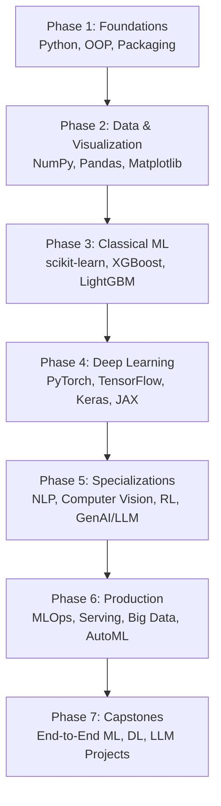

# AI Full Stack Engineer Course

> A complete, project-driven roadmap that takes you from `print("hello")` to shipping production RAG apps, MLOps pipelines, and end-to-end ML/DL/LLM systems — all in Jupyter notebooks you can run on your laptop.

[](https://www.linkedin.com/in/mayank-kumar-pokhriyal/)


---

## Why this course

- **Beginner-first.** Module 0 starts with what a variable is. By the time you finish, you have shipped a RAG application behind a FastAPI endpoint.
- **Project-driven.** Every notebook ends with a mini-project and interview Q&A — you learn by *building*, not by reading.
- **Modern, industry-grade stack.** PyTorch, Transformers, LangChain, FastAPI, MLflow, Polars, Ray — the same tools used at top AI teams in 2026.
- **Free and self-paced.** No sign-ups, no paywalls, no cloud credits required. Most notebooks run on a CPU laptop.
- **Ends in capstones.** Three full end-to-end projects (ML, DL, LLM) plus reusable templates you can fork for your own work.

## Who this is for

- Absolute beginners who can use a computer but have never written code.
- CS / data students who want a single, opinionated roadmap.
- Working software engineers transitioning into AI/ML.
- Self-taught practitioners who want to fill the gaps between "I trained a model" and "I shipped a model."

## What you will be able to do by the end

- Train classical ML models (XGBoost, LightGBM) and tune them with Optuna.
- Build and train deep neural nets in PyTorch and TensorFlow.
- Fine-tune Transformers for NLP and run YOLO for object detection.
- Build a RAG (Retrieval-Augmented Generation) chatbot over your own documents.
- Track experiments with MLflow / Weights & Biases.
- Serve any model behind a FastAPI / BentoML endpoint.
- Process datasets that don't fit in RAM with Polars, Dask, and PySpark.
- Talk fluently about MLOps, model serving, vector stores, and LLM application patterns in interviews.

---

## The roadmap (phase-based)



Follow phases in order. Inside each phase you can pick the libraries that match your goal.

---

## Course at a glance

15 modules, 60+ notebooks. Every link below opens the notebook on GitHub.

### Phase 1 — Foundations

[`AI_Full_Stack_Engineer_Course/00_Foundations/`](AI_Full_Stack_Engineer_Course/00_Foundations/) — *Python from zero to confident.*

- [01 Python Basics](AI_Full_Stack_Engineer_Course/00_Foundations/01_Python_Basics.ipynb)
- [02 Python Builtins](AI_Full_Stack_Engineer_Course/00_Foundations/02_Python_Builtins.ipynb)
- [03 OOP in Python](AI_Full_Stack_Engineer_Course/00_Foundations/03_OOP_in_Python.ipynb)
- [04 Virtual Env and Packaging](AI_Full_Stack_Engineer_Course/00_Foundations/04_Virtual_Env_and_Packaging.ipynb)

### Phase 2 — Data & Visualization

[`AI_Full_Stack_Engineer_Course/01_Core_Scientific_Computing/`](AI_Full_Stack_Engineer_Course/01_Core_Scientific_Computing/) — *The numerical & tabular toolbox every ML engineer needs.*

- [01 NumPy](AI_Full_Stack_Engineer_Course/01_Core_Scientific_Computing/01_NumPy.ipynb)
- [02 Pandas](AI_Full_Stack_Engineer_Course/01_Core_Scientific_Computing/02_Pandas.ipynb)
- [03 SciPy](AI_Full_Stack_Engineer_Course/01_Core_Scientific_Computing/03_SciPy.ipynb)

[`AI_Full_Stack_Engineer_Course/02_Data_Visualization/`](AI_Full_Stack_Engineer_Course/02_Data_Visualization/) — *See your data before you model it.*

- [01 Matplotlib](AI_Full_Stack_Engineer_Course/02_Data_Visualization/01_Matplotlib.ipynb)
- [02 Seaborn](AI_Full_Stack_Engineer_Course/02_Data_Visualization/02_Seaborn.ipynb)
- [03 Plotly](AI_Full_Stack_Engineer_Course/02_Data_Visualization/03_Plotly.ipynb)
- [04 Bokeh](AI_Full_Stack_Engineer_Course/02_Data_Visualization/04_Bokeh.ipynb)
- [05 Altair](AI_Full_Stack_Engineer_Course/02_Data_Visualization/05_Altair.ipynb)

### Phase 3 — Classical Machine Learning

[`AI_Full_Stack_Engineer_Course/03_Classical_Machine_Learning/`](AI_Full_Stack_Engineer_Course/03_Classical_Machine_Learning/) — *Models that win Kaggle competitions and power most real-world ML.*

- [01 Scikit-Learn](AI_Full_Stack_Engineer_Course/03_Classical_Machine_Learning/01_Scikit_Learn.ipynb)
- [02 XGBoost](AI_Full_Stack_Engineer_Course/03_Classical_Machine_Learning/02_XGBoost.ipynb)
- [03 LightGBM](AI_Full_Stack_Engineer_Course/03_Classical_Machine_Learning/03_LightGBM.ipynb)
- [04 CatBoost](AI_Full_Stack_Engineer_Course/03_Classical_Machine_Learning/04_CatBoost.ipynb)

### Phase 4 — Deep Learning

[`AI_Full_Stack_Engineer_Course/04_Deep_Learning/`](AI_Full_Stack_Engineer_Course/04_Deep_Learning/) — *Neural networks from autograd to training loops.*

- [01 PyTorch](AI_Full_Stack_Engineer_Course/04_Deep_Learning/01_PyTorch.ipynb)
- [02 TensorFlow](AI_Full_Stack_Engineer_Course/04_Deep_Learning/02_TensorFlow.ipynb)
- [03 Keras](AI_Full_Stack_Engineer_Course/04_Deep_Learning/03_Keras.ipynb)
- [04 JAX](AI_Full_Stack_Engineer_Course/04_Deep_Learning/04_JAX.ipynb)

### Phase 5 — Specializations

Pick one or all four. They are independent.

[`AI_Full_Stack_Engineer_Course/05_NLP/`](AI_Full_Stack_Engineer_Course/05_NLP/) — *From classical text processing to Transformers.*

- [01 NLTK](AI_Full_Stack_Engineer_Course/05_NLP/01_NLTK.ipynb)
- [02 spaCy](AI_Full_Stack_Engineer_Course/05_NLP/02_spaCy.ipynb)
- [03 Gensim](AI_Full_Stack_Engineer_Course/05_NLP/03_Gensim.ipynb)
- [04 SentenceTransformers](AI_Full_Stack_Engineer_Course/05_NLP/04_SentenceTransformers.ipynb)
- [05 Transformers](AI_Full_Stack_Engineer_Course/05_NLP/05_Transformers.ipynb)

[`AI_Full_Stack_Engineer_Course/06_Computer_Vision/`](AI_Full_Stack_Engineer_Course/06_Computer_Vision/) — *Pixels, CNNs, object detection.*

- [01 OpenCV](AI_Full_Stack_Engineer_Course/06_Computer_Vision/01_OpenCV.ipynb)
- [02 Torchvision](AI_Full_Stack_Engineer_Course/06_Computer_Vision/02_Torchvision.ipynb)
- [03 YOLO (Ultralytics)](AI_Full_Stack_Engineer_Course/06_Computer_Vision/03_YOLO_Ultralytics.ipynb)
- [04 Detectron2](AI_Full_Stack_Engineer_Course/06_Computer_Vision/04_Detectron2.ipynb)

[`AI_Full_Stack_Engineer_Course/07_Reinforcement_Learning/`](AI_Full_Stack_Engineer_Course/07_Reinforcement_Learning/) — *Agents that learn by trial and error.*

- [01 Gymnasium](AI_Full_Stack_Engineer_Course/07_Reinforcement_Learning/01_Gymnasium.ipynb)
- [02 Stable Baselines3](AI_Full_Stack_Engineer_Course/07_Reinforcement_Learning/02_Stable_Baselines3.ipynb)
- [03 RLlib](AI_Full_Stack_Engineer_Course/07_Reinforcement_Learning/03_RLlib.ipynb)

[`AI_Full_Stack_Engineer_Course/08_Generative_AI_LLM/`](AI_Full_Stack_Engineer_Course/08_Generative_AI_LLM/) — *Build with LLMs: APIs, RAG, serving, training.*

- [01 OpenAI SDK](AI_Full_Stack_Engineer_Course/08_Generative_AI_LLM/01_OpenAI_SDK.ipynb)
- [02 LangChain](AI_Full_Stack_Engineer_Course/08_Generative_AI_LLM/02_LangChain.ipynb)
- [03 LlamaIndex](AI_Full_Stack_Engineer_Course/08_Generative_AI_LLM/03_LlamaIndex.ipynb)
- [04 vLLM](AI_Full_Stack_Engineer_Course/08_Generative_AI_LLM/04_vLLM.ipynb)
- [05 DeepSpeed](AI_Full_Stack_Engineer_Course/08_Generative_AI_LLM/05_DeepSpeed.ipynb)

### Phase 6 — Production

[`AI_Full_Stack_Engineer_Course/09_MLOps/`](AI_Full_Stack_Engineer_Course/09_MLOps/) — *Track, version, schedule, and orchestrate.*

- [01 MLflow](AI_Full_Stack_Engineer_Course/09_MLOps/01_MLflow.ipynb)
- [02 Weights & Biases](AI_Full_Stack_Engineer_Course/09_MLOps/02_Weights_and_Biases.ipynb)
- [03 DVC](AI_Full_Stack_Engineer_Course/09_MLOps/03_DVC.ipynb)
- [04 Airflow](AI_Full_Stack_Engineer_Course/09_MLOps/04_Airflow.ipynb)
- [05 Kubeflow](AI_Full_Stack_Engineer_Course/09_MLOps/05_Kubeflow.ipynb)

[`AI_Full_Stack_Engineer_Course/10_Model_Serving/`](AI_Full_Stack_Engineer_Course/10_Model_Serving/) — *Turn a `.pkl` into an HTTP endpoint.*

- [01 Flask](AI_Full_Stack_Engineer_Course/10_Model_Serving/01_Flask.ipynb)
- [02 FastAPI](AI_Full_Stack_Engineer_Course/10_Model_Serving/02_FastAPI.ipynb)
- [03 BentoML](AI_Full_Stack_Engineer_Course/10_Model_Serving/03_BentoML.ipynb)
- [04 Ray Serve](AI_Full_Stack_Engineer_Course/10_Model_Serving/04_Ray_Serve.ipynb)

[`AI_Full_Stack_Engineer_Course/11_Data_Processing/`](AI_Full_Stack_Engineer_Course/11_Data_Processing/) — *When your data is bigger than your RAM.*

- [01 Polars](AI_Full_Stack_Engineer_Course/11_Data_Processing/01_Polars.ipynb)
- [02 Dask](AI_Full_Stack_Engineer_Course/11_Data_Processing/02_Dask.ipynb)
- [03 PySpark](AI_Full_Stack_Engineer_Course/11_Data_Processing/03_PySpark.ipynb)

[`AI_Full_Stack_Engineer_Course/12_AutoML_Experimentation/`](AI_Full_Stack_Engineer_Course/12_AutoML_Experimentation/) — *Hyperparameter search and AutoML.*

- [01 Optuna](AI_Full_Stack_Engineer_Course/12_AutoML_Experimentation/01_Optuna.ipynb)
- [02 Ray Tune](AI_Full_Stack_Engineer_Course/12_AutoML_Experimentation/02_Ray_Tune.ipynb)
- [03 AutoGluon](AI_Full_Stack_Engineer_Course/12_AutoML_Experimentation/03_AutoGluon.ipynb)
- [04 H2O](AI_Full_Stack_Engineer_Course/12_AutoML_Experimentation/04_H2O.ipynb)

### Phase 7 — Capstones & Templates

[`AI_Full_Stack_Engineer_Course/13_Capstone_Projects/`](AI_Full_Stack_Engineer_Course/13_Capstone_Projects/) — *Three end-to-end projects you can put on your resume.*

- [01 End-to-End ML Project](AI_Full_Stack_Engineer_Course/13_Capstone_Projects/01_End_to_End_ML_Project.ipynb)
- [02 End-to-End DL Project](AI_Full_Stack_Engineer_Course/13_Capstone_Projects/02_End_to_End_DL_Project.ipynb)
- [03 LLM Application Project (RAG + FastAPI)](AI_Full_Stack_Engineer_Course/13_Capstone_Projects/03_LLM_Application_Project.ipynb)

[`AI_Full_Stack_Engineer_Course/14_Templates/`](AI_Full_Stack_Engineer_Course/14_Templates/) — *Copy-paste starter kits for your own projects.*

- [01 ML Template](AI_Full_Stack_Engineer_Course/14_Templates/01_ML_Template.ipynb)
- [02 DL Template](AI_Full_Stack_Engineer_Course/14_Templates/02_DL_Template.ipynb)
- [03 LLM Template](AI_Full_Stack_Engineer_Course/14_Templates/03_LLM_Template.ipynb)

---

## Optional 16-week schedule (about 8–10 hours/week)

A realistic part-time pace. Speed up if you have prior experience, slow down if you are brand new to programming.

- **Week 1 — Foundations I.** `00_Foundations/01_Python_Basics`, `02_Python_Builtins`.
- **Week 2 — Foundations II.** `00_Foundations/03_OOP_in_Python`, `04_Virtual_Env_and_Packaging`.
- **Week 3 — Numerical Python.** `01_Core_Scientific_Computing/01_NumPy`, `02_Pandas`.
- **Week 4 — Stats + Visualization.** `01_Core_Scientific_Computing/03_SciPy`, `02_Data_Visualization/01_Matplotlib`, `02_Seaborn`. (Skim `03_Plotly`, `04_Bokeh`, `05_Altair`.)
- **Week 5 — Classical ML I.** `03_Classical_Machine_Learning/01_Scikit_Learn`.
- **Week 6 — Classical ML II.** `03_Classical_Machine_Learning/02_XGBoost`, `03_LightGBM`, `04_CatBoost`.
- **Week 7 — Deep Learning I.** `04_Deep_Learning/01_PyTorch`.
- **Week 8 — Deep Learning II.** `04_Deep_Learning/02_TensorFlow`, `03_Keras`. (Skim `04_JAX`.)
- **Week 9 — NLP.** `05_NLP/01_NLTK` → `05_Transformers`. Pick depth based on interest.
- **Week 10 — Computer Vision.** `06_Computer_Vision/01_OpenCV`, `02_Torchvision`, `03_YOLO_Ultralytics`. (Optional: `04_Detectron2`.)
- **Week 11 — Generative AI / LLMs.** `08_Generative_AI_LLM/01_OpenAI_SDK`, `02_LangChain`, `03_LlamaIndex`.
- **Week 12 — Experiment Tracking + Tuning.** `09_MLOps/01_MLflow` (or `02_Weights_and_Biases`), `12_AutoML_Experimentation/01_Optuna`.
- **Week 13 — Model Serving.** `10_Model_Serving/02_FastAPI`, `03_BentoML`.
- **Week 14 — Big Data + Pipelines.** `11_Data_Processing/01_Polars`, then either `02_Dask` or `03_PySpark`. `09_MLOps/04_Airflow`.
- **Week 15 — Capstone (pick one).** `13_Capstone_Projects/01_End_to_End_ML_Project` or `02_End_to_End_DL_Project` or `03_LLM_Application_Project`.
- **Week 16 — Polish & ship.** Push your capstone to GitHub, write a blog post, deploy the API, and update LinkedIn.

Optional / advanced (revisit anytime): `07_Reinforcement_Learning/`, `08_Generative_AI_LLM/04_vLLM` & `05_DeepSpeed`, `09_MLOps/03_DVC` & `05_Kubeflow`.

---

## Goal-based mini-tracks

Short on time? Pick a track and only do these modules.

### Track A — Become a Machine Learning Engineer

`00_Foundations/` → `01_Core_Scientific_Computing/` → `02_Data_Visualization/` (just `01_Matplotlib` + `02_Seaborn`) → `03_Classical_Machine_Learning/` → `12_AutoML_Experimentation/01_Optuna` → `09_MLOps/01_MLflow` → `10_Model_Serving/02_FastAPI` → `13_Capstone_Projects/01_End_to_End_ML_Project` → `14_Templates/01_ML_Template`

### Track B — Become an LLM / GenAI Engineer

`00_Foundations/` → `01_Core_Scientific_Computing/01_NumPy` & `02_Pandas` → `04_Deep_Learning/01_PyTorch` → `05_NLP/04_SentenceTransformers` & `05_Transformers` → `08_Generative_AI_LLM/` (all 5) → `10_Model_Serving/02_FastAPI` → `13_Capstone_Projects/03_LLM_Application_Project` → `14_Templates/03_LLM_Template`

### Track C — Become an MLOps Engineer

`00_Foundations/` → `01_Core_Scientific_Computing/02_Pandas` → `03_Classical_Machine_Learning/01_Scikit_Learn` → `09_MLOps/` (all 5) → `10_Model_Serving/` (all 4) → `11_Data_Processing/` (all 3) → `12_AutoML_Experimentation/01_Optuna` & `02_Ray_Tune` → `13_Capstone_Projects/01_End_to_End_ML_Project`

### Track D — Become a Computer Vision Engineer

`00_Foundations/` → `01_Core_Scientific_Computing/01_NumPy` → `02_Data_Visualization/01_Matplotlib` → `04_Deep_Learning/01_PyTorch` → `06_Computer_Vision/` (all 4) → `09_MLOps/01_MLflow` → `10_Model_Serving/02_FastAPI` → `13_Capstone_Projects/02_End_to_End_DL_Project`

---

## Getting started

### 1. Clone the repo

```bash
git clone https://github.com/<your-github-username>/Learning-AI-ML.git
cd Learning-AI-ML
```

### 2. Create a virtual environment

```bash
python3 -m venv .venv
source .venv/bin/activate          # macOS / Linux
# .venv\Scripts\activate           # Windows PowerShell
```

### 3. Install Jupyter

```bash
pip install --upgrade pip
pip install jupyterlab ipykernel
```

Each notebook has its own `pip install ...` cell at the top for the libraries it needs, so you only install what you actually use.

### 4. Launch Jupyter and open your first notebook

```bash
jupyter lab
```

Open [`AI_Full_Stack_Engineer_Course/00_Foundations/01_Python_Basics.ipynb`](AI_Full_Stack_Engineer_Course/00_Foundations/01_Python_Basics.ipynb) and you are off.

> **Tip:** If you have an NVIDIA GPU, you can install the GPU build of PyTorch / TensorFlow when you reach Phase 4 — the notebooks call out the relevant install commands.

---

## How to use each notebook

Every notebook follows the same structure so you build a learning rhythm:

1. **Read the markdown overview** — what you will learn, difficulty, time estimate.
2. **Run the install cell** — installs only the libraries this notebook needs.
3. **Work through the sections** — short concept blocks alternating with runnable code.
4. **Do the mini-project** — the most important part. Don't skip it.
5. **Review the Interview Q&A section** — this is what hiring managers actually ask.
6. **Skim the Resources section** — official docs and the next thing to read.

You learn by *typing the code yourself*, not by reading it.

---

## Repository structure

```
Learning-AI-ML/
├── README.md                              <- you are here
└── AI_Full_Stack_Engineer_Course/
    ├── 00_Foundations/                    Python, OOP, packaging
    ├── 01_Core_Scientific_Computing/      NumPy, Pandas, SciPy
    ├── 02_Data_Visualization/             Matplotlib, Seaborn, Plotly, Bokeh, Altair
    ├── 03_Classical_Machine_Learning/     scikit-learn, XGBoost, LightGBM, CatBoost
    ├── 04_Deep_Learning/                  PyTorch, TensorFlow, Keras, JAX
    ├── 05_NLP/                            NLTK, spaCy, Gensim, SentenceTransformers, Transformers
    ├── 06_Computer_Vision/                OpenCV, Torchvision, YOLO, Detectron2
    ├── 07_Reinforcement_Learning/         Gymnasium, Stable Baselines3, RLlib
    ├── 08_Generative_AI_LLM/              OpenAI SDK, LangChain, LlamaIndex, vLLM, DeepSpeed
    ├── 09_MLOps/                          MLflow, W&B, DVC, Airflow, Kubeflow
    ├── 10_Model_Serving/                  Flask, FastAPI, BentoML, Ray Serve
    ├── 11_Data_Processing/                Polars, Dask, PySpark
    ├── 12_AutoML_Experimentation/         Optuna, Ray Tune, AutoGluon, H2O
    ├── 13_Capstone_Projects/              End-to-end ML / DL / LLM projects
    └── 14_Templates/                      Copy-paste starter kits
```

---

## Recommended companion resources

These pair well with this course for theory & intuition:

- [3Blue1Brown — Neural Networks (YouTube series)](https://www.youtube.com/playlist?list=PLZHQObOWTQDNU6R1_67000Dx_ZCJB-3pi) — the best visual explanation of how NNs learn.
- [fast.ai — Practical Deep Learning](https://course.fast.ai/) — a great top-down DL course.
- [Andrej Karpathy — Neural Networks: Zero to Hero](https://www.youtube.com/playlist?list=PLAqhIrjkxbuWI23v9cThsA9GvCAUhRvKZ) — build GPT from scratch.
- [Hugging Face Course](https://huggingface.co/learn) — Transformers, NLP, diffusion.
- [Made With ML by Goku Mohandas](https://madewithml.com/) — MLOps best practices.

---

## About the author

Hi, I'm **Mayank Kumar Pokhriyal** — an AI/ML engineer with several years of industry experience building and shipping machine learning systems. I created this course because, when I was learning, I had to stitch together dozens of disconnected tutorials, courses, and docs to figure out what actually mattered in the real world. This is the single, opinionated roadmap I wish I had when I started — beginner-friendly at the entry, production-grade at the exit.

If this course helps you, I would love to hear about it. Connect with me, ask questions, or share what you built:

[**LinkedIn — linkedin.com/in/mayank-kumar-pokhriyal**](https://www.linkedin.com/in/mayank-kumar-pokhriyal/)

---

## Contributing & feedback

Found a typo, broken link, or have a suggestion? Open an [issue](../../issues) or send a pull request. Suggestions for new notebooks (libraries, topics, or capstones) are very welcome.

If a notebook helped you land a job, learn a concept, or just made you smile — a [star on this repo](../../stargazers) means a lot.

## License

This course is released under the [MIT License](LICENSE). You are free to use, modify, and share it — including for commercial work — as long as you keep the copyright notice. If you build something cool with it, please credit back.

---

If this course adds value to your learning journey, please star the repo and share it with one person who is just starting out. That is how this gets to the people who need it.
