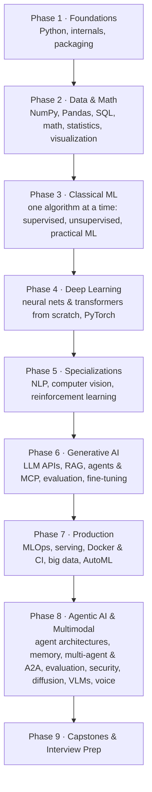

<div align="center">

# AI Full Stack Engineer Course

**From `print("hello")` to shipping RAG apps, AI agents and production ML systems.**

96 Jupyter notebooks that **actually run**. Each one has hands-on exercises with instant feedback, from-scratch builds, a real-data project and interview Q&A.

[](https://github.com/MayankKumarPokhriyal/Learning-AI-ML/actions/workflows/notebooks.yml)


[](CONTRIBUTING.md)
[](https://www.linkedin.com/in/mayank-kumar-pokhriyal/)

[Start here](#start-here-pick-your-level) · [Quick start](#quick-start) · [Course map](#course-at-a-glance) · [Study plan](docs/STUDY_PLAN.md) · [How to study](#how-to-study-day-to-day) · [Branches](#branches-main-and-learning) · [Troubleshooting](#troubleshooting)

</div>

---

## Contents

- [Why this course](#why-this-course)
- [Start here: pick your level](#start-here-pick-your-level)
- [Quick start](#quick-start)
- [How every notebook works](#how-every-notebook-works)
- [The roadmap](#the-roadmap)
- [Course at a glance](#course-at-a-glance)
- [Study plans](#study-plans)
- [Getting started (full setup)](#getting-started-full-setup)
- [How to study day to day](#how-to-study-day-to-day)
- [Branches: `main` and `learning`](#branches-main-and-learning)
- [Troubleshooting](#troubleshooting)
- [Contributing](#contributing)
- [Repository structure](#repository-structure)
- [Companion resources](#companion-resources)
- [About the author](#about-the-author)
- [License](#license)

---

## Why this course

- **Beginner-first.** Module 00 starts with what a variable is. Every term is defined the first time it appears.
- **Everything runs for real.** Every notebook is executed top to bottom with its outputs saved. There are no simulated results or invented metrics, and conclusions are computed from the data. The whole course is re-run with every exercise solution before release.
- **You write code, not just read it.** Every notebook has ✍️ *Your Turn* exercises and a graded 🟢/🟡/🔴 practice set. Run a cell and you instantly see ✅ correct, ⏳ not attempted, or ❌ with a hint. Solutions stay hidden until you want them.
- **Built for interviews.** Each notebook has a 🔧 *Build It From Scratch* section (softmax, k-NN, backprop, attention, gradient boosting and more, with only NumPy or PyTorch). It also has 10–15 real interview questions with 30-second answers, deeper follow-ups and common wrong answers, plus a quick quiz. Module 15 covers coding rounds, ML/LLM/agentic system design and behavioral rounds.
- **Current tools (2026).** NumPy 2, pandas 3, scikit-learn 1.9, PyTorch 2.14, Transformers 5, LangChain/LangGraph, OpenAI Agents SDK, PydanticAI, MCP, A2A, MLflow 3, Airflow 3, Spark 4.
- **No API keys required.** LLM notebooks run against a free local model (`gpt-oss-20b` via llama.cpp) through the OpenAI-compatible API. The same code works with Ollama, LM Studio, OpenAI or Anthropic by changing three environment variables.
- **Verified resources.** Every video, paper and doc link is checked automatically, and its title matches its label.

**Who it's for:** beginners who want one ordered path into AI; students and software engineers moving into ML or AI engineering; and anyone preparing for **ML engineer, AI/LLM engineer, AI agent engineer, MLOps or data science interviews**.

---

## Start here: pick your level

Every notebook labels its sections 🟢 beginner, 🟡 intermediate or 🔴 interview depth, so you can go as deep as you're ready for.

| If you are… | Start with | Then | Focus on |
|---|---|---|---|
| 🟢 **New to programming** | [00 · Python Basics](AI_Full_Stack_Engineer_Course/00_Foundations/01_Python_Basics.ipynb) | Follow [the study plan](docs/STUDY_PLAN.md) from week 1, in order. Skip *(optional)* notebooks. | 🟢 sections, ✍️ Your Turn exercises, the 📝 cheat sheet |
| 🟡 **Comfortable with Python, new to ML** | [01 · NumPy](AI_Full_Stack_Engineer_Course/01_Core_Scientific_Computing/01_NumPy.ipynb) → [03 · ML Fundamentals](AI_Full_Stack_Engineer_Course/03_Classical_Machine_Learning/01_ML_Fundamentals_From_Scratch.ipynb) | The classical ML series (03), then deep learning (04) and GenAI (08) | 🔧 Build It From Scratch, 🏋️ practice sets, 🚀 mini projects |
| 🔴 **Working engineer moving into AI** | [08 · LLM APIs & Prompting](AI_Full_Stack_Engineer_Course/08_Generative_AI_LLM/01_LLM_APIs_and_Prompting.ipynb) | Agentic AI (16), production (09–10), multimodal (17), capstones 03–05 | 🔴 exercises, measured comparisons, 🎤 debugging and design questions |
| 🎯 **Interviewing soon** | [15 · Interview Prep](AI_Full_Stack_Engineer_Course/15_Interview_Prep/) | ML coding drills, DSA patterns, ML/LLM/agentic system design, behavioral | Timed drills, [flashcards](#flashcards-for-spaced-repetition), every 🎤 Interview Q&A |

Want a specific role? See the [goal-based tracks](#goal-based-tracks).

---

## Quick start

For experienced users on macOS (Apple Silicon) or Linux. Full, step-by-step instructions for every OS are in [Getting started](#getting-started-full-setup).

```bash
git clone https://github.com/MayankKumarPokhriyal/Learning-AI-ML.git
cd Learning-AI-ML
git switch learning                      # do your work here; main stays clean
uv venv --python 3.12 && source .venv/bin/activate
uv pip install -r requirements.txt
python tools/check_setup.py              # verify everything
tools/start_notebook.sh                  # opens classic Jupyter Notebook
```

---

## How every notebook works

Every notebook follows the same rhythm (full spec: [docs/NOTEBOOK_TEMPLATE.md](docs/NOTEBOOK_TEMPLATE.md)):

| Section | What you do |
|---|---|
| 🤔 What Is It? · 🎯 Why It Matters | Plain-English intuition, and where it shows up in jobs and interviews |
| ✅ By the End You Can · 📋 Contents · ⚙️ Setup | Learning goals, then one setup cell (with the first-run cost: downloads, model calls, time) |
| 1…N Concept sections | Intuition → runnable code → ✍️ **Your Turn** → 💡 **Interview angle** |
| 🔧 Build It From Scratch | Implement the core idea yourself and check it against the library |
| ⚠️ Common Pitfalls | Runnable ❌ wrong / ✅ right pairs |
| 🏋️ Practice Exercises | 🟢 ×3 · 🟡 ×2 · 🔴 ×1 interview-style, with instant feedback |
| 🚀 Mini Project | A real dataset, end to end, plus 🗣️ how to talk about it in an interview |
| 🎤 Interview Q&A · 🧪 Quick Quiz | Answer out loud first, then reveal |
| 📚 Resources · 📝 Cheat Sheet · ➡️ What's Next | Verified docs, videos and papers; a one-table summary; the next notebook |

---

## The roadmap



Notebooks marked *(optional)* are useful but rarely needed for interviews, so skim or skip them if time is short.

---

## Course at a glance

### Phase 1 — Foundations · [`00_Foundations/`](AI_Full_Stack_Engineer_Course/00_Foundations/)

| # | Notebook | You will learn |
|---|---|---|
| 01 | [Python Basics](AI_Full_Stack_Engineer_Course/00_Foundations/01_Python_Basics.ipynb) | Types, containers and their costs, functions, mutability, errors, files |
| 02 | [Python Builtins](AI_Full_Stack_Engineer_Course/00_Foundations/02_Python_Builtins.ipynb) | Generators, closures, decorators, context managers, collections, itertools |
| 03 | [OOP in Python](AI_Full_Stack_Engineer_Course/00_Foundations/03_OOP_in_Python.ipynb) | Classes, MRO, dunder methods, dataclasses, a scikit-learn-style API from scratch |
| 04 | [Virtual Env & Packaging](AI_Full_Stack_Engineer_Course/00_Foundations/04_Virtual_Env_and_Packaging.ipynb) | venv, uv, lock files, `pyproject.toml`, building and testing a package |
| 05 | [Python Internals & Concurrency](AI_Full_Stack_Engineer_Course/00_Foundations/05_Python_Internals_and_Concurrency.ipynb) | References, GC, the GIL, threads vs processes vs asyncio |

### Phase 2 — Data & Math · [`01_Core_Scientific_Computing/`](AI_Full_Stack_Engineer_Course/01_Core_Scientific_Computing/) · [`02_Data_Visualization/`](AI_Full_Stack_Engineer_Course/02_Data_Visualization/)

| # | Notebook | You will learn |
|---|---|---|
| 01 | [NumPy](AI_Full_Stack_Engineer_Course/01_Core_Scientific_Computing/01_NumPy.ipynb) | Vectorization, broadcasting, views vs copies, linear regression from scratch |
| 02 | [Pandas](AI_Full_Stack_Engineer_Course/01_Core_Scientific_Computing/02_Pandas.ipynb) | pandas 3 idioms, groupby/window functions, joins, reshaping, leakage-safe cleaning |
| 03 | [SQL with DuckDB](AI_Full_Stack_Engineer_Course/01_Core_Scientific_Computing/03_SQL_with_DuckDB.ipynb) | Joins, CTEs, window functions, classic SQL interview problems |
| 04 | [Math for ML](AI_Full_Stack_Engineer_Course/01_Core_Scientific_Computing/04_Math_for_ML.ipynb) | Vectors, matrices, SVD/PCA, gradients, chain rule, entropy |
| 05 | [Statistics & Probability](AI_Full_Stack_Engineer_Course/01_Core_Scientific_Computing/05_Statistics_and_Probability.ipynb) | CLT, confidence intervals, hypothesis tests, power, A/B testing |
| 01 | [Matplotlib & Seaborn](AI_Full_Stack_Engineer_Course/02_Data_Visualization/01_Matplotlib_and_Seaborn.ipynb) | The plots every ML engineer makes, EDA that tells the truth |
| 02 | [Plotly](AI_Full_Stack_Engineer_Course/02_Data_Visualization/02_Plotly.ipynb) *(optional)* | Interactive charts and ML dashboards |

### Phase 3 — Classical Machine Learning · [`03_Classical_Machine_Learning/`](AI_Full_Stack_Engineer_Course/03_Classical_Machine_Learning/)

An **algorithm-by-algorithm series**, like a dedicated playlist, with one algorithm per notebook. Each one has an 🃏 **Algorithm Card** (objective, key hyperparameters, scaling needs, complexity, strengths and weaknesses, when to use it, best libraries). Each also covers the math at interview depth, experiments that break its assumptions, validation curves, and a fair head-to-head against neighbouring algorithms. You implement the algorithm in NumPy and check it against scikit-learn.

**The big picture**

| # | Notebook | You will learn |
|---|---|---|
| 01 | [ML Fundamentals From Scratch](AI_Full_Stack_Engineer_Course/03_Classical_Machine_Learning/01_ML_Fundamentals_From_Scratch.ipynb) | Supervised vs unsupervised, losses, L1/L2, bias–variance, CV, metrics, calibration, in NumPy |
| 02 | [Scikit-Learn](AI_Full_Stack_Engineer_Course/03_Classical_Machine_Learning/02_Scikit_Learn.ipynb) | Pipelines, CV strategies, tuning, imbalance, thresholds, persistence |

**Supervised learning**

| # | Notebook | You will learn |
|---|---|---|
| 03 | [Linear Regression](AI_Full_Stack_Engineer_Course/03_Classical_Machine_Learning/03_Linear_Regression.ipynb) | OLS, gradient descent, Ridge/Lasso/ElasticNet, assumptions and diagnostics, statsmodels inference |
| 04 | [Logistic Regression](AI_Full_Stack_Engineer_Course/03_Classical_Machine_Learning/04_Logistic_Regression.ipynb) | Log-loss, odds ratios, regularization, multiclass, thresholds and calibration |
| 05 | [K-Nearest Neighbors](AI_Full_Stack_Engineer_Course/03_Classical_Machine_Learning/05_K_Nearest_Neighbors.ipynb) | Distance metrics, choosing k, scaling, KD/ball trees, the curse of dimensionality |
| 06 | [Naive Bayes](AI_Full_Stack_Engineer_Course/03_Classical_Machine_Learning/06_Naive_Bayes.ipynb) | Bayes' rule, Gaussian/Multinomial/Bernoulli NB, smoothing, text classification |
| 07 | [Support Vector Machines](AI_Full_Stack_Engineer_Course/03_Classical_Machine_Learning/07_Support_Vector_Machines.ipynb) | Margins, hinge loss, the kernel trick, C and gamma, SVR |
| 08 | [Decision Trees](AI_Full_Stack_Engineer_Course/03_Classical_Machine_Learning/08_Decision_Trees.ipynb) | Gini vs entropy, CART splits, pruning, feature importance pitfalls |
| 09 | [Random Forest & Bagging](AI_Full_Stack_Engineer_Course/03_Classical_Machine_Learning/09_Random_Forest_and_Bagging.ipynb) | Bootstrap, variance reduction, OOB error, Extra Trees, permutation importance |
| 10 | [Gradient Boosting](AI_Full_Stack_Engineer_Course/03_Classical_Machine_Learning/10_Gradient_Boosting.ipynb) | XGBoost, LightGBM, CatBoost, and boosting math from scratch |
| 11 | [Ensembles: Voting, Stacking & AdaBoost](AI_Full_Stack_Engineer_Course/03_Classical_Machine_Learning/11_Ensembles_Voting_Stacking_AdaBoost.ipynb) | Hard/soft voting, leakage-free stacking, AdaBoost's exponential loss |

**Unsupervised learning**

| # | Notebook | You will learn |
|---|---|---|
| 12 | [Clustering: K-Means & Hierarchical](AI_Full_Stack_Engineer_Course/03_Classical_Machine_Learning/12_Clustering_KMeans_and_Hierarchical.ipynb) | Lloyd's algorithm, k-means++, choosing k, linkages and dendrograms, cluster profiling |
| 13 | [Clustering: DBSCAN & Gaussian Mixtures](AI_Full_Stack_Engineer_Course/03_Classical_Machine_Learning/13_Clustering_DBSCAN_and_Gaussian_Mixtures.ipynb) | Density clustering, HDBSCAN, EM, BIC/AIC, soft assignments |
| 14 | [Dimensionality Reduction: PCA, t-SNE, UMAP](AI_Full_Stack_Engineer_Course/03_Classical_Machine_Learning/14_Dimensionality_Reduction_PCA_tSNE_UMAP.ipynb) | PCA via SVD, explained variance, t-SNE and UMAP for visualization, when not to trust them |
| 15 | [Anomaly Detection](AI_Full_Stack_Engineer_Course/03_Classical_Machine_Learning/15_Anomaly_Detection.ipynb) | Isolation Forest, LOF, One-Class SVM, PyOD, evaluating with few labels |

**Practical ML**

| # | Notebook | You will learn |
|---|---|---|
| 16 | [Feature Engineering & Selection](AI_Full_Stack_Engineer_Course/03_Classical_Machine_Learning/16_Feature_Engineering_and_Selection.ipynb) | Encoding, transforms, interactions, filter/wrapper/embedded selection without leakage |
| 17 | [Imbalanced Data & Model Evaluation](AI_Full_Stack_Engineer_Course/03_Classical_Machine_Learning/17_Imbalanced_Data_and_Model_Evaluation.ipynb) | Resampling and SMOTE done right, class weights, PR curves, cost-based thresholds |
| 18 | [Model Interpretability: SHAP & LIME](AI_Full_Stack_Engineer_Course/03_Classical_Machine_Learning/18_Model_Interpretability_SHAP_LIME.ipynb) | Shapley values, SHAP and LIME, partial dependence, explaining models honestly |
| 19 | [Recommender Systems](AI_Full_Stack_Engineer_Course/03_Classical_Machine_Learning/19_Recommender_Systems.ipynb) | Collaborative filtering, matrix factorization, implicit feedback, ranking metrics |
| 20 | [Time-Series Forecasting](AI_Full_Stack_Engineer_Course/03_Classical_Machine_Learning/20_Time_Series_Forecasting.ipynb) | Decomposition, ETS/ARIMA with statsmodels, lag features with boosting, backtesting |

### Phase 4 — Deep Learning · [`04_Deep_Learning/`](AI_Full_Stack_Engineer_Course/04_Deep_Learning/)

| # | Notebook | You will learn |
|---|---|---|
| 01 | [Neural Networks From Scratch](AI_Full_Stack_Engineer_Course/04_Deep_Learning/01_Neural_Networks_From_Scratch.ipynb) | Backprop by hand, a tiny autograd engine, optimizers, dropout |
| 02 | [PyTorch](AI_Full_Stack_Engineer_Course/04_Deep_Learning/02_PyTorch.ipynb) | Tensors, autograd, training loops done right, CNNs, mixed precision |
| 03 | [Transformers From Scratch](AI_Full_Stack_Engineer_Course/04_Deep_Learning/03_Transformers_From_Scratch.ipynb) | BPE, attention, RoPE, a mini-GPT, KV cache |
| 04 | [Keras 3 Overview](AI_Full_Stack_Engineer_Course/04_Deep_Learning/04_Keras_3_Overview.ipynb) *(optional)* | Multi-backend Keras, callbacks, custom layers |

### Phase 5 — Specializations

**NLP** · [`05_NLP/`](AI_Full_Stack_Engineer_Course/05_NLP/)

| # | Notebook | You will learn |
|---|---|---|
| 01 | [Classical NLP](AI_Full_Stack_Engineer_Course/05_NLP/01_Classical_NLP.ipynb) | Tokenization, spaCy, TF-IDF baselines, word2vec |
| 02 | [Embeddings & Semantic Search](AI_Full_Stack_Engineer_Course/05_NLP/02_Embeddings_and_Semantic_Search.ipynb) | Bi- vs cross-encoders, FAISS, hybrid search, reranking, retrieval metrics |
| 03 | [Hugging Face Transformers](AI_Full_Stack_Engineer_Course/05_NLP/03_HuggingFace_Transformers.ipynb) | Tokenizers, fine-tuning with Trainer, NER, LoRA intro |

**Computer Vision** · [`06_Computer_Vision/`](AI_Full_Stack_Engineer_Course/06_Computer_Vision/)

| # | Notebook | You will learn |
|---|---|---|
| 01 | [OpenCV](AI_Full_Stack_Engineer_Course/06_Computer_Vision/01_OpenCV.ipynb) | Filtering, edges, contours, feature matching, homography |
| 02 | [CNNs & Transfer Learning](AI_Full_Stack_Engineer_Course/06_Computer_Vision/02_CNNs_and_Transfer_Learning.ipynb) | Convolution math, ResNets, fine-tuning, Grad-CAM |
| 03 | [YOLO Object Detection](AI_Full_Stack_Engineer_Course/06_Computer_Vision/03_YOLO_Object_Detection.ipynb) | IoU, NMS, mAP from scratch; training and tracking with YOLO |

**Reinforcement Learning** · [`07_Reinforcement_Learning/`](AI_Full_Stack_Engineer_Course/07_Reinforcement_Learning/)

| # | Notebook | You will learn |
|---|---|---|
| 01 | [Gymnasium & Q-Learning](AI_Full_Stack_Engineer_Course/07_Reinforcement_Learning/01_Gymnasium_and_Q_Learning.ipynb) | MDPs, Bellman equations, value iteration, Q-learning vs SARSA |
| 02 | [Deep RL with Stable-Baselines3](AI_Full_Stack_Engineer_Course/07_Reinforcement_Learning/02_Deep_RL_with_Stable_Baselines3.ipynb) | DQN, REINFORCE from scratch, PPO, and how RLHF works |

### Phase 6 — Generative AI & LLMs · [`08_Generative_AI_LLM/`](AI_Full_Stack_Engineer_Course/08_Generative_AI_LLM/)

| # | Notebook | You will learn |
|---|---|---|
| 01 | [LLM APIs & Prompting](AI_Full_Stack_Engineer_Course/08_Generative_AI_LLM/01_LLM_APIs_and_Prompting.ipynb) | Chat APIs, structured output, tool calling, streaming, cost & latency |
| 02 | [RAG From Scratch](AI_Full_Stack_Engineer_Course/08_Generative_AI_LLM/02_RAG_From_Scratch.ipynb) | Chunking, hybrid retrieval, reranking, grounded answers with citations |
| 03 | [LangChain & LangGraph](AI_Full_Stack_Engineer_Course/08_Generative_AI_LLM/03_LangChain_and_LangGraph.ipynb) | LCEL, stateful graphs, checkpoints, human-in-the-loop |
| 04 | [LlamaIndex](AI_Full_Stack_Engineer_Course/08_Generative_AI_LLM/04_LlamaIndex.ipynb) | Indexes, retrievers, query engines, workflows |
| 05 | [Agents, Tool Calling & MCP](AI_Full_Stack_Engineer_Course/08_Generative_AI_LLM/05_Agents_Tool_Calling_and_MCP.ipynb) | Agent loops, tool errors, MCP servers and clients, prompt-injection defenses |
| 06 | [LLM Evaluation](AI_Full_Stack_Engineer_Course/08_Generative_AI_LLM/06_LLM_Evaluation.ipynb) | Golden sets, retrieval metrics, LLM-as-judge, regression testing |
| 07 | [Fine-Tuning with LoRA & DPO](AI_Full_Stack_Engineer_Course/08_Generative_AI_LLM/07_Fine_Tuning_LoRA_and_DPO.ipynb) | SFT, LoRA/QLoRA, preference tuning, before/after evaluation |
| 08 | [LLM Inference & Serving](AI_Full_Stack_Engineer_Course/08_Generative_AI_LLM/08_LLM_Inference_and_Serving.ipynb) | KV-cache math, batching, quantization, vLLM and llama.cpp |
| 09 | [Distributed Training Overview](AI_Full_Stack_Engineer_Course/08_Generative_AI_LLM/09_Distributed_Training_Overview.ipynb) *(optional)* | Data/tensor/pipeline parallelism, ZeRO, FSDP memory math |

### Phase 7 — Production

**MLOps** · [`09_MLOps/`](AI_Full_Stack_Engineer_Course/09_MLOps/)

| # | Notebook | You will learn |
|---|---|---|
| 01 | [MLflow](AI_Full_Stack_Engineer_Course/09_MLOps/01_MLflow.ipynb) | Tracking, registry aliases, serving, tracing |
| 02 | [Weights & Biases](AI_Full_Stack_Engineer_Course/09_MLOps/02_Weights_and_Biases.ipynb) *(optional)* | Experiment dashboards, artifacts, sweeps |
| 03 | [DVC](AI_Full_Stack_Engineer_Course/09_MLOps/03_DVC.ipynb) | Data versioning, reproducible pipelines, experiments |
| 04 | [Airflow](AI_Full_Stack_Engineer_Course/09_MLOps/04_Airflow.ipynb) | Airflow 3 TaskFlow DAGs, scheduling, testing, a retraining DAG |
| 05 | [Model Monitoring & Drift](AI_Full_Stack_Engineer_Course/09_MLOps/05_Model_Monitoring_and_Drift.ipynb) | Drift statistics, monitoring without labels, retraining triggers |
| 06 | [Kubeflow Pipelines](AI_Full_Stack_Engineer_Course/09_MLOps/06_Kubeflow_Pipelines.ipynb) *(optional)* | KFP v2 components, artifacts, control flow, local and Docker runs |

**Model Serving** · [`10_Model_Serving/`](AI_Full_Stack_Engineer_Course/10_Model_Serving/)

| # | Notebook | You will learn |
|---|---|---|
| 01 | [FastAPI](AI_Full_Stack_Engineer_Course/10_Model_Serving/01_FastAPI.ipynb) | Model APIs, validation, async vs sync, testing (with a Flask comparison) |
| 02 | [Docker & CI/CD](AI_Full_Stack_Engineer_Course/10_Model_Serving/02_Docker_and_CI_CD.ipynb) | Dockerfiles for ML, GitHub Actions, load testing |
| 03 | [BentoML](AI_Full_Stack_Engineer_Course/10_Model_Serving/03_BentoML.ipynb) | Services, adaptive batching, packaging |
| 04 | [Ray Serve](AI_Full_Stack_Engineer_Course/10_Model_Serving/04_Ray_Serve.ipynb) *(optional)* | Deployments, composition, autoscaling |

**Data Processing** · [`11_Data_Processing/`](AI_Full_Stack_Engineer_Course/11_Data_Processing/)

| # | Notebook | You will learn |
|---|---|---|
| 01 | [Polars](AI_Full_Stack_Engineer_Course/11_Data_Processing/01_Polars.ipynb) | Expressions, lazy queries, pushdown, fair benchmarks |
| 02 | [PySpark](AI_Full_Stack_Engineer_Course/11_Data_Processing/02_PySpark.ipynb) | Spark 4, joins and shuffles, AQE, skew, MLlib |
| 03 | [Dask](AI_Full_Stack_Engineer_Course/11_Data_Processing/03_Dask.ipynb) *(optional)* | Partitions, task graphs, distributed scheduler |

**AutoML & Experimentation** · [`12_AutoML_Experimentation/`](AI_Full_Stack_Engineer_Course/12_AutoML_Experimentation/)

| # | Notebook | You will learn |
|---|---|---|
| 01 | [Optuna](AI_Full_Stack_Engineer_Course/12_AutoML_Experimentation/01_Optuna.ipynb) | TPE, pruning, multi-objective tuning, tuning without leakage |
| 02 | [Ray Tune](AI_Full_Stack_Engineer_Course/12_AutoML_Experimentation/02_Ray_Tune.ipynb) | Distributed tuning, ASHA, population-based training |
| 03 | [AutoGluon](AI_Full_Stack_Engineer_Course/12_AutoML_Experimentation/03_AutoGluon.ipynb) *(optional)* | Strong tabular baselines in minutes |

### Phase 8 — Agentic AI & Multimodal · [`16_Agentic_AI/`](AI_Full_Stack_Engineer_Course/16_Agentic_AI/) · [`17_Multimodal_and_Generative_Models/`](AI_Full_Stack_Engineer_Course/17_Multimodal_and_Generative_Models/)

**Agentic AI:** how to design, build, evaluate, secure and ship AI agents. Every pattern, framework and defense is measured on real tasks against a local LLM. (The study plan puts this module right after Model Serving.)

| # | Notebook | You will learn |
|---|---|---|
| 01 | [Agent Architectures & Workflow Patterns](AI_Full_Stack_Engineer_Course/16_Agentic_AI/01_Agent_Architectures_and_Workflow_Patterns.ipynb) | Chaining, routing, parallelization, orchestrator–workers, evaluator–optimizer; ReAct vs plan-and-execute vs ReWOO vs Reflexion; loop control |
| 02 | [Context Engineering & Agent Memory](AI_Full_Stack_Engineer_Course/16_Agentic_AI/02_Context_Engineering_and_Agent_Memory.ipynb) | Context budgets, compaction, tool-output handling, prompt caching, working/episodic/semantic memory, LangGraph stores |
| 03 | [Code Agents, Browser Agents & Computer Use](AI_Full_Stack_Engineer_Course/16_Agentic_AI/03_Code_Agents_Browser_Agents_and_Computer_Use.ipynb) | Tool design for agents, code-as-action, sandboxing, Playwright web agents, coding-agent loops |
| 04 | [Multi-Agent Systems & A2A](AI_Full_Stack_Engineer_Course/16_Agentic_AI/04_Multi_Agent_Systems_and_A2A.ipynb) | Supervisor, handoffs, debate, blackboard; why multi-agent systems fail; the A2A protocol vs MCP |
| 05 | [Agent Frameworks Compared](AI_Full_Stack_Engineer_Course/16_Agentic_AI/05_Agent_Frameworks_Compared.ipynb) | One agent built in the raw SDK, OpenAI Agents SDK, PydanticAI, smolagents and LangGraph, measured; CrewAI, AutoGen and ADK explained |
| 06 | [Agent Evaluation & Benchmarks](AI_Full_Stack_Engineer_Course/16_Agentic_AI/06_Agent_Evaluation_and_Benchmarks.ipynb) | Outcome vs trajectory metrics, pass^k, simulated users, trajectory judges, CI gates, SWE-bench/τ-bench/GAIA |
| 07 | [Agent Security & Guardrails](AI_Full_Stack_Engineer_Course/16_Agentic_AI/07_Agent_Security_and_Guardrails.ipynb) | Prompt injection, the lethal trifecta, least privilege, human-in-the-loop, dual-LLM/CaMeL, NeMo Guardrails, red teaming |
| 08 | [Production Agents](AI_Full_Stack_Engineer_Course/16_Agentic_AI/08_Production_Agents_Observability_Reliability_Cost.ipynb) | Tracing, SLOs, retries and idempotency, durable execution, streaming job APIs, cost control, safe rollouts |

**Multimodal & Generative Models**

| # | Notebook | You will learn |
|---|---|---|
| 01 | [Generative Models: VAEs, GANs & Diffusion](AI_Full_Stack_Engineer_Course/17_Multimodal_and_Generative_Models/01_Generative_Models_VAEs_GANs_Diffusion.ipynb) | Autoencoders to VAEs, GANs, a diffusion model from scratch, latent diffusion and guidance |
| 02 | [Vision-Language Models & Multimodal RAG](AI_Full_Stack_Engineer_Course/17_Multimodal_and_Generative_Models/02_Vision_Language_Models_and_Multimodal_RAG.ipynb) | CLIP/SigLIP, small VLMs, document understanding, multimodal retrieval |
| 03 | [Speech AI & Voice Agents](AI_Full_Stack_Engineer_Course/17_Multimodal_and_Generative_Models/03_Speech_AI_and_Voice_Agents.ipynb) | Whisper speech recognition, text-to-speech, latency budgets and turn-taking for voice agents |

### Phase 9 — Capstones, Templates & Interview Prep

**Capstone projects** · [`13_Capstone_Projects/`](AI_Full_Stack_Engineer_Course/13_Capstone_Projects/). Each one is a notebook walkthrough **plus a real project folder** with code, tests, a Dockerfile and a CI workflow you can put on your résumé.

| # | Project | Project folder |
|---|---|---|
| 01 | [End-to-End ML Project](AI_Full_Stack_Engineer_Course/13_Capstone_Projects/01_End_to_End_ML_Project.ipynb) | [`churn_service/`](AI_Full_Stack_Engineer_Course/13_Capstone_Projects/churn_service/) |
| 02 | [End-to-End DL Project](AI_Full_Stack_Engineer_Course/13_Capstone_Projects/02_End_to_End_DL_Project.ipynb) | [`image_classifier/`](AI_Full_Stack_Engineer_Course/13_Capstone_Projects/image_classifier/) |
| 03 | [LLM RAG Assistant](AI_Full_Stack_Engineer_Course/13_Capstone_Projects/03_LLM_RAG_Assistant_Project.ipynb) | [`rag_assistant/`](AI_Full_Stack_Engineer_Course/13_Capstone_Projects/rag_assistant/) |
| 04 | [AI Agent](AI_Full_Stack_Engineer_Course/13_Capstone_Projects/04_AI_Agent_Project.ipynb) | [`ai_agent/`](AI_Full_Stack_Engineer_Course/13_Capstone_Projects/ai_agent/) |
| 05 | [Multi-Agent System: AI Data Analyst Team](AI_Full_Stack_Engineer_Course/13_Capstone_Projects/05_Multi_Agent_System_Project.ipynb) | [`data_analyst_agents/`](AI_Full_Stack_Engineer_Course/13_Capstone_Projects/data_analyst_agents/) |

**Templates** · [`14_Templates/`](AI_Full_Stack_Engineer_Course/14_Templates/), fill-in starters for your own projects: [ML](AI_Full_Stack_Engineer_Course/14_Templates/01_ML_Template.ipynb) · [DL](AI_Full_Stack_Engineer_Course/14_Templates/02_DL_Template.ipynb) · [LLM](AI_Full_Stack_Engineer_Course/14_Templates/03_LLM_Template.ipynb)

**Interview Prep** · [`15_Interview_Prep/`](AI_Full_Stack_Engineer_Course/15_Interview_Prep/)

| # | Notebook | Round it prepares you for |
|---|---|---|
| 01 | [ML Coding Drills](AI_Full_Stack_Engineer_Course/15_Interview_Prep/01_ML_Coding_Drills.ipynb) | "Implement X in NumPy/PyTorch" coding rounds |
| 02 | [ML Theory & Statistics Questions](AI_Full_Stack_Engineer_Course/15_Interview_Prep/02_ML_Theory_and_Statistics_Questions.ipynb) | Conceptual ML/stats screens |
| 03 | [ML System Design](AI_Full_Stack_Engineer_Course/15_Interview_Prep/03_ML_System_Design.ipynb) | Recommenders, fraud, search ranking design rounds |
| 04 | [LLM System Design](AI_Full_Stack_Engineer_Course/15_Interview_Prep/04_LLM_System_Design.ipynb) | RAG, agents, evaluation, cost/latency design rounds |
| 05 | [Behavioral & Project Storytelling](AI_Full_Stack_Engineer_Course/15_Interview_Prep/05_Behavioral_and_Project_Storytelling.ipynb) | "Walk me through your project" and behavioral rounds |
| 06 | [DSA Coding Patterns — Part 1](AI_Full_Stack_Engineer_Course/15_Interview_Prep/06_DSA_Coding_Patterns_Part_1.ipynb) | LeetCode-style rounds: arrays & hashing, two pointers, sliding window, stacks, binary search |
| 07 | [DSA Coding Patterns — Part 2](AI_Full_Stack_Engineer_Course/15_Interview_Prep/07_DSA_Coding_Patterns_Part_2.ipynb) | Linked lists, trees, graphs, heaps, dynamic programming, backtracking |
| 08 | [Agentic AI System Design](AI_Full_Stack_Engineer_Course/15_Interview_Prep/08_Agentic_AI_System_Design.ipynb) | "Design an agent that…" rounds: architecture, tools and permissions, memory, evaluation, security, cost |

---

## Study plans

### Full course, week by week

**[docs/STUDY_PLAN.md](docs/STUDY_PLAN.md)** has a checkbox for every notebook in order. It also explains how to study a single notebook and sets out a weekly rhythm with review days and mock interviews. Budget roughly 6–8 hours per notebook.

| Pace | Duration |
|---|---|
| Full-time (~6 h/day) | about 21 weeks |
| Part-time (2–3 h/day) | about 12 months |

| Weeks (full-time) | Focus |
|---|---|
| 1–3 | Python, NumPy, Pandas, SQL, math, statistics, visualization (00–02) |
| 3–7 | Classical ML algorithm series (03), with DSA practice starting in week 3 |
| 7–9 | Deep learning, NLP, computer vision, RL (04–07) |
| 9–11 | Generative AI & LLMs (08) |
| 11–13 | MLOps and model serving (09–10) |
| 13–15 | Agentic AI (16), then multimodal and generative models (17) |
| 16 | Data processing and AutoML (11–12) |
| 17–19 | Capstones and your own portfolio project (13–14) |
| 20–21 | Interview prep (15) and mock interviews |

### Goal-based tracks

- **ML Engineer:** 00 → 01 → 02/01 → 03 → 04/01–02 → 09/01, 03, 05 → 10/01–02 → 12/01 → Capstone 01 → 15/01–03
- **LLM / GenAI Engineer:** 00 → 01/01–02, 04 → 03/01 → 04/01–03 → 05/02–03 → 08 (all) → 10/01–02 → 16/01–02, 06–07 → 17/02 → Capstones 03–05 → 15/01, 04–05, 08
- **AI Agent Engineer:** 00 → 01/01–02 → 03/01, 04 → 04/01–03 → 05/02 → 08/01–03, 05–06 → 10/01–02 → 16 (all) → 17/03 → Capstones 04–05 → 15/04, 06–08
- **MLOps Engineer:** 00 → 01/02–03 → 03/02 → 09 (all) → 10 (all) → 11/01–02 → 12/01 → Capstone 01 → 15/03
- **Computer Vision Engineer:** 00 → 01/01, 04 → 02/01 → 04/01–02 → 06 (all) → 09/01 → 10/01–02 → Capstone 02
- **Data Scientist:** 00/01–02 → 01 (all) → 02/01 → 03 (all) → 12/01 → Capstone 01 → 15/01–03, 06
- **Interview sprint (4 weeks, if you already know the basics):** every 🔧 *Build It From Scratch* section in modules 01–04 and 08 → all Interview Q&A sections (as flashcards) → module 15

### Flashcards for spaced repetition

```bash
python tools/export_flashcards.py            # → flashcards/ai_course_interview_flashcards.csv
python tools/export_flashcards.py --include-quiz
```

This exports every 🎤 interview question in the course (1,600+ cards), with its answer, as a CSV that Anki can import directly. Cards are tagged by module and notebook, so you can review only what you've finished.

---

## Getting started (full setup)

Setup takes about 15–30 minutes, most of it downloading packages. You need no API keys and no GPU.

### What you need

| | |
|---|---|
| **Operating system** | **macOS 14 (Sonoma) or newer on Apple Silicon**, **Linux** (x86-64 or ARM64), or **Windows 10/11** (x86-64). Intel Macs are not supported, because current PyTorch, Ray and FAISS publish no Intel-Mac packages; use a Linux machine or a cloud VM instead. |
| **Memory** | 16 GB RAM recommended; 8 GB works for most notebooks if you run one at a time. The optional 20B local LLM for modules 08 and 16 needs about 16 GB by itself (smaller models work too; see [the local LLM step](#6-optional-local-llm-for-modules-08-and-16)). |
| **Disk** | About 12 GB: 4 GB for the main environment, plus 8 GB of datasets and models downloaded as you progress. Doing everything takes about 30 GB, including the optional environments (3.5 GB) and the local LLM (12 GB). |
| **Software** | [Git](https://git-scm.com/downloads) and [uv](https://docs.astral.sh/uv/getting-started/installation/). uv installs Python 3.12 for you. |

Install uv if you don't have it:

```bash
# macOS / Linux
curl -LsSf https://astral.sh/uv/install.sh | sh
# Windows (PowerShell)
powershell -ExecutionPolicy ByPass -c "irm https://astral.sh/uv/install.ps1 | iex"
```

### 1. Fork (or clone) and switch to the `learning` branch

Click **Fork** at the top of this page so you can push your own progress, then:

```bash
git clone https://github.com/<your-username>/Learning-AI-ML.git
cd Learning-AI-ML
git switch learning        # your workspace; main stays as the clean course
```

Just want to read? `git clone https://github.com/MayankKumarPokhriyal/Learning-AI-ML.git` works too. See [Branches](#branches-main-and-learning) for how the two branches work.

### 2. Create the main environment

```bash
uv venv --python 3.12
source .venv/bin/activate          # Windows: .venv\Scripts\activate
uv pip install -r requirements.txt
```

- **Linux without an NVIDIA GPU:** add `--torch-backend=cpu` to the install command. It downloads the CPU build of PyTorch instead of several GB of CUDA libraries.
- **No uv?** Run `python3.12 -m venv .venv`, activate it, then `pip install -r requirements.txt`.

This one environment runs every notebook except the five listed in step 4.

### 3. Check your setup

```bash
python tools/check_setup.py
```

The check:

- confirms Python 3.12 and every pinned package;
- test-imports the libraries that need native code (PyTorch, XGBoost, LightGBM, FAISS, spaCy, OpenCV, the agent frameworks);
- checks that Jupyter will use this environment;
- reports which optional pieces (Java, Docker, Playwright's browser, FFmpeg, a local LLM, the extra environments) you still need, and for which notebooks.

Fix anything marked ❌ before you start. Anything marked ⏭️ can wait until you reach the notebook that needs it.

### 4. Optional: separate environments for five notebooks

These notebooks need library versions that conflict with the main environment, so each gets its own small environment. Create one only when you reach that notebook:

| Notebook | Environment |
|---|---|
| `08_Generative_AI_LLM/04_LlamaIndex` | `llamaindex` |
| `09_MLOps/04_Airflow` | `airflow` (on Windows, use [WSL2](https://learn.microsoft.com/windows/wsl/install): Airflow doesn't run natively on Windows) |
| `09_MLOps/05_Model_Monitoring_and_Drift` | `monitoring` |
| `09_MLOps/06_Kubeflow_Pipelines` | `kfp` |
| `12_AutoML_Experimentation/03_AutoGluon` | `autogluon` |

```bash
# replace airflow with the environment you need
uv venv .venvs/airflow --python 3.12
uv pip install --python .venvs/airflow -r requirements-airflow.txt
```

Keep the `.venvs/<name>` folder names. On macOS and Linux, the launcher in step 7 finds them and adds a kernel for each one. On Windows, register the kernel yourself:

```powershell
.venvs\airflow\Scripts\python -m ipykernel install --user --name ai-course-airflow --display-name "AI course: airflow env"
```

### 5. Optional: system tools for a few notebooks

| Needed for | macOS | Ubuntu / Debian | Windows |
|---|---|---|---|
| XGBoost / LightGBM | `brew install libomp` | preinstalled | preinstalled |
| PySpark (`11_Data_Processing/02_PySpark`) | `brew install openjdk@17` | `sudo apt install openjdk-17-jdk` | [Temurin JDK 17](https://adoptium.net/temurin/releases/?version=17), then set `JAVA_HOME` |
| Docker notebook, capstone containers, Kubeflow's Docker runner | [Docker Desktop](https://www.docker.com/products/docker-desktop/) | [Docker Engine](https://docs.docker.com/engine/install/) | [Docker Desktop](https://www.docker.com/products/docker-desktop/) |
| Local LLM (modules 08 and 16, capstones 03–05, speech notebook) | `brew install llama.cpp` | [llama.cpp releases](https://github.com/ggml-org/llama.cpp/releases) | [llama.cpp releases](https://github.com/ggml-org/llama.cpp/releases) |
| Browser agents (`16_Agentic_AI/03`) | `python -m playwright install chromium` | `python -m playwright install --with-deps chromium` | `python -m playwright install chromium` |
| Audio decoding for the speech notebook (`17_Multimodal_and_Generative_Models/03`, via torchcodec) | `brew install ffmpeg` | `sudo apt install ffmpeg` | a shared FFmpeg build from [ffmpeg.org](https://ffmpeg.org/download.html) on your `PATH` |

### 6. Optional: local LLM for modules 08 and 16

The LLM notebooks call an OpenAI-compatible API. The free default is `gpt-oss-20b` served by llama.cpp. The first start downloads about 12 GB:

```bash
llama-server -hf ggml-org/gpt-oss-20b-GGUF --port 8080 --jinja -c 32768 -np 2
```

`--jinja` enables tool calling, and `-c 32768 -np 2` gives two parallel requests with 16k tokens of context each, which is what the agent notebooks expect. Leave it running in its own terminal. Stop it (Ctrl+C) while you work through the deep learning and multimodal notebooks, to free memory.

To use a different server or a smaller model, set these variables **in the terminal you start Jupyter from**:

| Variable | Default | Examples |
|---|---|---|
| `LLM_BASE_URL` | `http://127.0.0.1:8080/v1` | Ollama `http://localhost:11434/v1` · LM Studio `http://localhost:1234/v1` · OpenAI `https://api.openai.com/v1` |
| `LLM_MODEL` | `gpt-oss-20b` | any model your server provides |
| `LLM_API_KEY` | `local` | your provider's key (never commit it) |

```bash
export LLM_BASE_URL=http://localhost:11434/v1 LLM_MODEL=<model-name>    # macOS / Linux
$env:LLM_BASE_URL="http://localhost:11434/v1"; $env:LLM_MODEL="<model-name>"   # Windows PowerShell
```

Smaller models work, but tool calling and structured output are less reliable than with the default.

### 7. Launch Jupyter

**macOS / Linux:**

```bash
tools/start_notebook.sh      # classic Jupyter Notebook, with the course kernels registered
```

The launcher makes the default **Python 3** kernel use `.venv`, even if you already have another Python kernel installed. It also adds a kernel for each environment in `.venvs/` and prints which notebooks need which kernel. Your global Jupyter settings are not changed.

**Windows (or if you prefer JupyterLab):** with `.venv` activated, run `jupyter notebook` or `jupyter lab`. If `check_setup.py` warned that the **python3** kernel points at a different Python, run this once: `python -m ipykernel install --user --name python3 --display-name "Python 3 (AI course)"`.

Open [`00_Foundations/01_Python_Basics.ipynb`](AI_Full_Stack_Engineer_Course/00_Foundations/01_Python_Basics.ipynb) (or your [starting point](#start-here-pick-your-level)) and follow [docs/STUDY_PLAN.md](docs/STUDY_PLAN.md).

---

## How to study day to day

### Recommended setup: classic Jupyter Notebook on your own machine

| Tool | Use it for | Why |
|---|---|---|
| **Jupyter Notebook, locally** (recommended) | Learning: every notebook, cell by cell | The course is built and verified this way. Everything works locally: the local LLM, Docker, Playwright and the separate environments. |
| **VS Code** | The capstone project folders (`13_Capstone_Projects/*/`): code, tests, Dockerfiles, git | A real editor, debugger and terminal for project code. Notebooks also open fine here: pick `.venv` as the kernel. |
| **Google Colab** | Optional: only the few cells that need an NVIDIA GPU (QLoRA, vLLM) | Colab has no local LLM server, no Docker, no separate environments, and sessions reset, so most notebooks won't run as designed there. |

### A daily routine

1. **Start Jupyter.** `cd Learning-AI-ML && source .venv/bin/activate && tools/start_notebook.sh`
2. **Start extras only when a notebook needs them.**
   - **Local LLM:** modules 08 and 16, capstones 03–05 and the speech notebook ([step 6](#6-optional-local-llm-for-modules-08-and-16)). Stop it during deep learning and multimodal notebooks.
   - **Docker Desktop:** the Docker notebook and capstone containers.
3. **Open today's notebook** from the [study plan](docs/STUDY_PLAN.md) and choose **Kernel → Restart & Clear Output**.
4. **Run one cell at a time** with **Shift + Enter**. Before each run, predict the output; after it, change one thing and re-run.
5. **Solve every ✍️ Your Turn cell** until the checker shows ✅. Open a solution only after a real attempt.
6. **Say each 💡 Interview angle and 🎤 Q&A answer out loud** before revealing the answer. Keep a *mistakes log*.
7. **Keep one notebook open at a time** and shut finished ones down from the **Running** tab. Memory matters for the LLM and deep learning notebooks.
8. **Commit your progress** on the `learning` branch (see below) and review 20 flashcards.

Each notebook's ⚙️ Setup section tells you its **first-run cost**: downloads, LLM calls and time. Agent notebooks replay model replies from a cache in `_outputs/` on later runs, so re-runs are much faster.

---

## Branches: `main` and `learning`

| Branch | What it is | Who changes it |
|---|---|---|
| **`main`** | The complete, verified course: every notebook with real saved outputs, the tools and the docs. | Only course updates (pull requests). Never do exercises here. |
| **`learning`** | Your workspace: the same course, where you run notebooks, type answers and keep notes. | You. Mistakes here never touch `main`. |

```bash
git switch learning                                   # work here
git add -A && git commit -m "Week 4: logistic regression exercises"
git push                                              # back up your progress (to your fork)

git switch main && git pull                           # get course updates…
git switch learning && git merge main                 # …and bring them into your workspace

git restore --source main -- AI_Full_Stack_Engineer_Course/<module>/<notebook>.ipynb   # reset one notebook to the course version
```

If a merge from `main` conflicts in a notebook you've been editing, keep your version, or take the course version with the `git restore` command above. **Using a fork?** Add the original course as `upstream` once (`git remote add upstream https://github.com/MayankKumarPokhriyal/Learning-AI-ML.git`). Then refresh your `main` with `git switch main && git pull upstream main && git push origin main` and merge it into `learning` as above.

---

## Troubleshooting

| Symptom | Fix |
|---|---|
| `ModuleNotFoundError` for a package that is installed | The notebook is running on a different Python. Run `python tools/check_setup.py`, start Jupyter with `tools/start_notebook.sh`, or choose the `.venv` kernel (**Kernel → Change kernel**). |
| `libomp.dylib` / `XGBoostError` / LightGBM fails to load (macOS) | `brew install libomp`, then restart the kernel. |
| PySpark: "Java not found" or "needs Java 17" | Install Java 17 or 21 ([step 5](#5-optional-system-tools-for-a-few-notebooks)), set `JAVA_HOME`, restart the kernel. |
| Docker Desktop is open but `docker info` returns an error (for example *500 Internal Server Error*) | The engine is stuck. Run `docker desktop restart` (or quit and reopen Docker Desktop), wait until `docker info` works, then re-run the cell. |
| An LLM cell hangs or says the server is unreachable | Check `curl http://127.0.0.1:8080/health` returns `{"status":"ok"}`. Start the server ([step 6](#6-optional-local-llm-for-modules-08-and-16)), and remember the first run of an agent notebook makes real model calls, so it is slow. |
| The kernel dies or the machine slows to a crawl | Out of memory. Shut down other notebooks (**Running** tab → Shutdown), stop `llama-server` if the notebook doesn't need it, and re-run. |
| A cell prints `⏭️ Skipped …` | That cell needs something optional: an NVIDIA GPU, a paid API key, Docker, or Kubernetes. The message says exactly what to set up; the rest of the notebook still works. |
| A dataset download fails | Re-run the cell (public servers hiccup). Downloads are cached in each module's `_outputs/` folder; delete that folder to force a fresh download. |
| You broke a notebook and want the original back | `git restore --source main -- AI_Full_Stack_Engineer_Course/<module>/<notebook>.ipynb` |
| Timed DSA checks don't stop a slow solution (Windows) | Expected: the timeout uses a Unix signal, so on Windows the time is only reported after the call finishes. |

---

## Contributing

Found a bug, a dead link, an outdated API, or have an idea for a notebook? Contributions are welcome.

- **Report an issue:** use the [issue forms](../../issues/new/choose) (notebook bug or content request).
- **Send a fix:** read [CONTRIBUTING.md](CONTRIBUTING.md) for the notebook checklist, then open a pull request against `main`.
- **Be kind:** see the [Code of Conduct](CODE_OF_CONDUCT.md). Security concerns go through [SECURITY.md](SECURITY.md).

Notebooks are checked with [`tools/nb.py`](tools/nb.py) (structure, execution, exercise solutions, links), and a GitHub Actions workflow runs the structure check on every pull request. The authoring spec is [docs/NOTEBOOK_TEMPLATE.md](docs/NOTEBOOK_TEMPLATE.md), and [docs/COURSE_MAP.md](docs/COURSE_MAP.md) lists every notebook with its kind and environment.

If a notebook helped you learn something or land a job, a [star on the repo](../../stargazers) means a lot.

---

## Repository structure

```
Learning-AI-ML/
├── README.md
├── CONTRIBUTING.md · CODE_OF_CONDUCT.md · SECURITY.md · LICENSE
├── requirements.txt                       main environment (pinned)
├── requirements-<env>.txt                 five small extra environments
├── .github/                               CI workflow, issue forms, PR template
├── docs/                                  study plan, course map, notebook template spec
├── tools/
│   ├── check_setup.py                     verify your installation
│   ├── start_notebook.sh                  launch Jupyter Notebook with the course kernels
│   ├── export_flashcards.py               interview Q&A → Anki CSV
│   └── nb.py                              build / run / check / link-check notebooks
└── AI_Full_Stack_Engineer_Course/
    ├── 00_Foundations/                    Python, internals, packaging
    ├── 01_Core_Scientific_Computing/      NumPy, Pandas, SQL, math, statistics
    ├── 02_Data_Visualization/             Matplotlib & Seaborn, Plotly
    ├── 03_Classical_Machine_Learning/     20 notebooks: supervised, unsupervised, practical ML
    ├── 04_Deep_Learning/                  NNs & transformers from scratch, PyTorch, Keras
    ├── 05_NLP/                            classical NLP, embeddings, Hugging Face
    ├── 06_Computer_Vision/                OpenCV, CNNs, YOLO
    ├── 07_Reinforcement_Learning/         tabular RL, deep RL
    ├── 08_Generative_AI_LLM/              APIs, RAG, LangGraph, agents & MCP, evaluation, fine-tuning, serving
    ├── 09_MLOps/                          MLflow, W&B, DVC, Airflow, monitoring, Kubeflow
    ├── 10_Model_Serving/                  FastAPI, Docker & CI/CD, BentoML, Ray Serve
    ├── 11_Data_Processing/                Polars, PySpark, Dask
    ├── 12_AutoML_Experimentation/         Optuna, Ray Tune, AutoGluon
    ├── 13_Capstone_Projects/              5 end-to-end projects with real code
    ├── 14_Templates/                      starter notebooks
    ├── 15_Interview_Prep/                 ML coding drills, DSA patterns, theory, ML/LLM/agentic system design, storytelling
    ├── 16_Agentic_AI/                     agent architectures, memory, code & browser agents, multi-agent & A2A, evaluation, security, production
    └── 17_Multimodal_and_Generative_Models/  diffusion, vision-language models, speech and voice agents
```

---

## Companion resources

- [3Blue1Brown — Neural Networks](https://www.youtube.com/playlist?list=PLZHQObOWTQDNU6R1_67000Dx_ZCJB-3pi): the best visual explanation of how neural networks learn
- [Andrej Karpathy — Neural Networks: Zero to Hero](https://www.youtube.com/playlist?list=PLAqhIrjkxbuWI23v9cThsA9GvCAUhRvKZ): build GPT from scratch
- [fast.ai — Practical Deep Learning](https://course.fast.ai/): top-down deep learning
- [Hugging Face Learn](https://huggingface.co/learn): LLMs, agents, and more
- [Made With ML](https://madewithml.com/): MLOps best practices

---

## About the author

Hi, I'm **Mayank Kumar Pokhriyal**, an AI/ML engineer with several years of industry experience building and shipping machine learning systems. I created this course because, when I was learning, I had to stitch together dozens of disconnected tutorials, courses and docs to figure out what actually mattered in the real world. This is the single, opinionated roadmap I wish I'd had when I started: beginner-friendly at the entry, production-grade at the exit.

If this course helps you, I'd love to hear about it. Connect with me, ask questions, or share what you built:

[**LinkedIn — linkedin.com/in/mayank-kumar-pokhriyal**](https://www.linkedin.com/in/mayank-kumar-pokhriyal/)

---

## License

Released under the [MIT License](LICENSE). Datasets and pretrained models used by the notebooks keep their own licences, which each notebook states where it downloads them.
