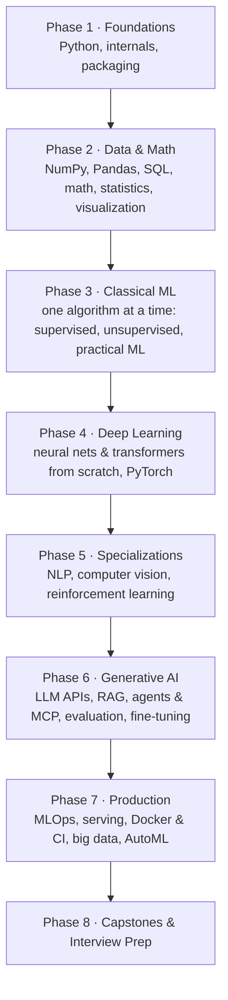

# AI Full Stack Engineer Course

> A beginner-first, interview-ready roadmap from `print("hello")` to shipping RAG apps, AI agents, and production ML systems — 83 Jupyter notebooks that **actually run**, each with exercises, from-scratch builds, a real-data project, and interview Q&A.

[](https://www.linkedin.com/in/mayank-kumar-pokhriyal/)


---

## Why this course

- **Beginner-first.** Module 00 starts with what a variable is. Every term is defined the first time it appears.
- **Everything runs for real.** Every notebook is executed top to bottom with its outputs saved — no simulated results, no invented metrics. Conclusions are computed from the data.
- **You write code, not just read it.** Every notebook has ✍️ *Your Turn* exercises and a graded 🟢/🟡/🔴 practice set. Run a cell and you instantly see ✅ correct, ⏳ not attempted, or ❌ with a hint. Solutions are hidden until you want them.
- **Built for interviews.** Each notebook has a 🔧 *Build It From Scratch* section (softmax, k-NN, backprop, attention, gradient boosting… with only NumPy/PyTorch), 10–15 real interview questions with 30-second answers, deeper follow-ups and common wrong answers, and a quick quiz.
- **Current tools (2026).** NumPy 2, pandas 3, scikit-learn 1.9, PyTorch 2.14, Transformers 5, LangChain/LangGraph, MCP, MLflow 3, Airflow 3, Spark 4.
- **No API keys required.** LLM notebooks run against a free local model (e.g. `gpt-oss-20b` via llama.cpp) through the OpenAI-compatible API; the same code works with Ollama, LM Studio, OpenAI, or Anthropic by changing three environment variables.
- **Verified resources.** Every video, paper, and doc link is checked automatically and its title matches its label.

## Who this is for

- Beginners who have never written code and want a single, ordered path into AI.
- Students and software engineers moving into ML / AI engineering.
- Anyone preparing for **ML engineer, AI/LLM engineer, MLOps, or data science interviews**.

---

## How every notebook works

Every notebook follows the same rhythm (full spec: [docs/NOTEBOOK_TEMPLATE.md](docs/NOTEBOOK_TEMPLATE.md)):

| Section | What you do |
|---|---|
| 🤔 What Is It? · 🎯 Why It Matters | Plain-English intuition, and where it shows up in jobs and interviews |
| ✅ By the End You Can · 📋 Contents · ⚙️ Setup | Learning goals, then one setup cell |
| 1…N Concept sections | Intuition → runnable code → ✍️ **Your Turn** → 💡 **Interview angle** |
| 🔧 Build It From Scratch | Implement the core idea yourself and check it against the library |
| ⚠️ Common Pitfalls | Runnable ❌ wrong / ✅ right pairs |
| 🏋️ Practice Exercises | 🟢 ×3 · 🟡 ×2 · 🔴 ×1 interview-style, with instant feedback |
| 🚀 Mini Project | A real dataset, end to end — plus 🗣️ how to talk about it in an interview |
| 🎤 Interview Q&A · 🧪 Quick Quiz | Answer out loud first, then reveal |
| 📚 Resources · 📝 Cheat Sheet · ➡️ What's Next | Verified docs, videos, papers; a one-table summary; the next notebook |

---

## The roadmap



Notebooks marked *(optional)* are useful but rarely needed for interviews — skim or skip them if time is short.

---

## Course at a glance

### Phase 1 — Foundations · [`00_Foundations/`](AI_Full_Stack_Engineer_Course/00_Foundations/)

| # | Notebook | You will learn |
|---|---|---|
| 01 | [Python Basics](AI_Full_Stack_Engineer_Course/00_Foundations/01_Python_Basics.ipynb) | Types, containers and their costs, functions, mutability, errors, files |
| 02 | [Python Builtins](AI_Full_Stack_Engineer_Course/00_Foundations/02_Python_Builtins.ipynb) | Generators, closures, decorators, context managers, collections, itertools |
| 03 | [OOP in Python](AI_Full_Stack_Engineer_Course/00_Foundations/03_OOP_in_Python.ipynb) | Classes, MRO, dunder methods, dataclasses, a scikit-learn-style API from scratch |
| 04 | [Virtual Env & Packaging](AI_Full_Stack_Engineer_Course/00_Foundations/04_Virtual_Env_and_Packaging.ipynb) | venv, uv, lock files, `pyproject.toml`, building and testing a package |
| 05 | [Python Internals & Concurrency](AI_Full_Stack_Engineer_Course/00_Foundations/05_Python_Internals_and_Concurrency.ipynb) | References, GC, the GIL, threads vs processes vs asyncio |

### Phase 2 — Data & Math · [`01_Core_Scientific_Computing/`](AI_Full_Stack_Engineer_Course/01_Core_Scientific_Computing/) · [`02_Data_Visualization/`](AI_Full_Stack_Engineer_Course/02_Data_Visualization/)

| # | Notebook | You will learn |
|---|---|---|
| 01 | [NumPy](AI_Full_Stack_Engineer_Course/01_Core_Scientific_Computing/01_NumPy.ipynb) | Vectorization, broadcasting, views vs copies, linear regression from scratch |
| 02 | [Pandas](AI_Full_Stack_Engineer_Course/01_Core_Scientific_Computing/02_Pandas.ipynb) | pandas 3 idioms, groupby/window functions, joins, reshaping, leakage-safe cleaning |
| 03 | [SQL with DuckDB](AI_Full_Stack_Engineer_Course/01_Core_Scientific_Computing/03_SQL_with_DuckDB.ipynb) | Joins, CTEs, window functions, classic SQL interview problems |
| 04 | [Math for ML](AI_Full_Stack_Engineer_Course/01_Core_Scientific_Computing/04_Math_for_ML.ipynb) | Vectors, matrices, SVD/PCA, gradients, chain rule, entropy |
| 05 | [Statistics & Probability](AI_Full_Stack_Engineer_Course/01_Core_Scientific_Computing/05_Statistics_and_Probability.ipynb) | CLT, confidence intervals, hypothesis tests, power, A/B testing |
| 01 | [Matplotlib & Seaborn](AI_Full_Stack_Engineer_Course/02_Data_Visualization/01_Matplotlib_and_Seaborn.ipynb) | The plots every ML engineer makes, EDA that tells the truth |
| 02 | [Plotly](AI_Full_Stack_Engineer_Course/02_Data_Visualization/02_Plotly.ipynb) *(optional)* | Interactive charts and ML dashboards |

### Phase 3 — Classical Machine Learning · [`03_Classical_Machine_Learning/`](AI_Full_Stack_Engineer_Course/03_Classical_Machine_Learning/)

An **algorithm-by-algorithm series**, like a dedicated playlist: one algorithm per notebook. Each one has an 🃏 **Algorithm Card** (objective, key hyperparameters, scaling needs, complexity, strengths and weaknesses, when to use it, best libraries). Each also covers the math at interview depth, experiments that break its assumptions, validation curves, and a fair head-to-head against neighbouring algorithms. You implement the algorithm in NumPy and check it against scikit-learn.

**The big picture**

| # | Notebook | You will learn |
|---|---|---|
| 01 | [ML Fundamentals From Scratch](AI_Full_Stack_Engineer_Course/03_Classical_Machine_Learning/01_ML_Fundamentals_From_Scratch.ipynb) | Supervised vs unsupervised, losses, L1/L2, bias–variance, CV, metrics, calibration — in NumPy |
| 02 | [Scikit-Learn](AI_Full_Stack_Engineer_Course/03_Classical_Machine_Learning/02_Scikit_Learn.ipynb) | Pipelines, CV strategies, tuning, imbalance, thresholds, persistence |

**Supervised learning**

| # | Notebook | You will learn |
|---|---|---|
| 03 | [Linear Regression](AI_Full_Stack_Engineer_Course/03_Classical_Machine_Learning/03_Linear_Regression.ipynb) | OLS, gradient descent, Ridge/Lasso/ElasticNet, assumptions and diagnostics, statsmodels inference |
| 04 | [Logistic Regression](AI_Full_Stack_Engineer_Course/03_Classical_Machine_Learning/04_Logistic_Regression.ipynb) | Log-loss, odds ratios, regularization, multiclass, thresholds and calibration |
| 05 | [K-Nearest Neighbors](AI_Full_Stack_Engineer_Course/03_Classical_Machine_Learning/05_K_Nearest_Neighbors.ipynb) | Distance metrics, choosing k, scaling, KD/ball trees, the curse of dimensionality |
| 06 | [Naive Bayes](AI_Full_Stack_Engineer_Course/03_Classical_Machine_Learning/06_Naive_Bayes.ipynb) | Bayes' rule, Gaussian/Multinomial/Bernoulli NB, smoothing, text classification |
| 07 | [Support Vector Machines](AI_Full_Stack_Engineer_Course/03_Classical_Machine_Learning/07_Support_Vector_Machines.ipynb) | Margins, hinge loss, the kernel trick, C and gamma, SVR |
| 08 | [Decision Trees](AI_Full_Stack_Engineer_Course/03_Classical_Machine_Learning/08_Decision_Trees.ipynb) | Gini vs entropy, CART splits, pruning, feature importance pitfalls |
| 09 | [Random Forest & Bagging](AI_Full_Stack_Engineer_Course/03_Classical_Machine_Learning/09_Random_Forest_and_Bagging.ipynb) | Bootstrap, variance reduction, OOB error, Extra Trees, permutation importance |
| 10 | [Gradient Boosting](AI_Full_Stack_Engineer_Course/03_Classical_Machine_Learning/10_Gradient_Boosting.ipynb) | XGBoost, LightGBM, CatBoost — and boosting math from scratch |
| 11 | [Ensembles: Voting, Stacking & AdaBoost](AI_Full_Stack_Engineer_Course/03_Classical_Machine_Learning/11_Ensembles_Voting_Stacking_AdaBoost.ipynb) | Hard/soft voting, leakage-free stacking, AdaBoost's exponential loss |

**Unsupervised learning**

| # | Notebook | You will learn |
|---|---|---|
| 12 | [Clustering: K-Means & Hierarchical](AI_Full_Stack_Engineer_Course/03_Classical_Machine_Learning/12_Clustering_KMeans_and_Hierarchical.ipynb) | Lloyd's algorithm, k-means++, choosing k, linkages and dendrograms, cluster profiling |
| 13 | [Clustering: DBSCAN & Gaussian Mixtures](AI_Full_Stack_Engineer_Course/03_Classical_Machine_Learning/13_Clustering_DBSCAN_and_Gaussian_Mixtures.ipynb) | Density clustering, HDBSCAN, EM, BIC/AIC, soft assignments |
| 14 | [Dimensionality Reduction: PCA, t-SNE, UMAP](AI_Full_Stack_Engineer_Course/03_Classical_Machine_Learning/14_Dimensionality_Reduction_PCA_tSNE_UMAP.ipynb) | PCA via SVD, explained variance, t-SNE and UMAP for visualization, when not to trust them |
| 15 | [Anomaly Detection](AI_Full_Stack_Engineer_Course/03_Classical_Machine_Learning/15_Anomaly_Detection.ipynb) | Isolation Forest, LOF, One-Class SVM, PyOD, evaluating with few labels |

**Practical ML**

| # | Notebook | You will learn |
|---|---|---|
| 16 | [Feature Engineering & Selection](AI_Full_Stack_Engineer_Course/03_Classical_Machine_Learning/16_Feature_Engineering_and_Selection.ipynb) | Encoding, transforms, interactions, filter/wrapper/embedded selection without leakage |
| 17 | [Imbalanced Data & Model Evaluation](AI_Full_Stack_Engineer_Course/03_Classical_Machine_Learning/17_Imbalanced_Data_and_Model_Evaluation.ipynb) | Resampling and SMOTE done right, class weights, PR curves, cost-based thresholds |
| 18 | [Model Interpretability: SHAP & LIME](AI_Full_Stack_Engineer_Course/03_Classical_Machine_Learning/18_Model_Interpretability_SHAP_LIME.ipynb) | Shapley values, SHAP and LIME, partial dependence, explaining models honestly |
| 19 | [Recommender Systems](AI_Full_Stack_Engineer_Course/03_Classical_Machine_Learning/19_Recommender_Systems.ipynb) | Collaborative filtering, matrix factorization, implicit feedback, ranking metrics |
| 20 | [Time-Series Forecasting](AI_Full_Stack_Engineer_Course/03_Classical_Machine_Learning/20_Time_Series_Forecasting.ipynb) | Decomposition, ETS/ARIMA with statsmodels, lag features with boosting, backtesting |

### Phase 4 — Deep Learning · [`04_Deep_Learning/`](AI_Full_Stack_Engineer_Course/04_Deep_Learning/)

| # | Notebook | You will learn |
|---|---|---|
| 01 | [Neural Networks From Scratch](AI_Full_Stack_Engineer_Course/04_Deep_Learning/01_Neural_Networks_From_Scratch.ipynb) | Backprop by hand, a tiny autograd engine, optimizers, dropout |
| 02 | [PyTorch](AI_Full_Stack_Engineer_Course/04_Deep_Learning/02_PyTorch.ipynb) | Tensors, autograd, training loops done right, CNNs, mixed precision |
| 03 | [Transformers From Scratch](AI_Full_Stack_Engineer_Course/04_Deep_Learning/03_Transformers_From_Scratch.ipynb) | BPE, attention, RoPE, a mini-GPT, KV cache |
| 04 | [Keras 3 Overview](AI_Full_Stack_Engineer_Course/04_Deep_Learning/04_Keras_3_Overview.ipynb) *(optional)* | Multi-backend Keras, callbacks, custom layers |

### Phase 5 — Specializations

**NLP** · [`05_NLP/`](AI_Full_Stack_Engineer_Course/05_NLP/)

| # | Notebook | You will learn |
|---|---|---|
| 01 | [Classical NLP](AI_Full_Stack_Engineer_Course/05_NLP/01_Classical_NLP.ipynb) | Tokenization, spaCy, TF-IDF baselines, word2vec |
| 02 | [Embeddings & Semantic Search](AI_Full_Stack_Engineer_Course/05_NLP/02_Embeddings_and_Semantic_Search.ipynb) | Bi- vs cross-encoders, FAISS, hybrid search, reranking, retrieval metrics |
| 03 | [Hugging Face Transformers](AI_Full_Stack_Engineer_Course/05_NLP/03_HuggingFace_Transformers.ipynb) | Tokenizers, fine-tuning with Trainer, NER, LoRA intro |

**Computer Vision** · [`06_Computer_Vision/`](AI_Full_Stack_Engineer_Course/06_Computer_Vision/)

| # | Notebook | You will learn |
|---|---|---|
| 01 | [OpenCV](AI_Full_Stack_Engineer_Course/06_Computer_Vision/01_OpenCV.ipynb) | Filtering, edges, contours, feature matching, homography |
| 02 | [CNNs & Transfer Learning](AI_Full_Stack_Engineer_Course/06_Computer_Vision/02_CNNs_and_Transfer_Learning.ipynb) | Convolution math, ResNets, fine-tuning, Grad-CAM |
| 03 | [YOLO Object Detection](AI_Full_Stack_Engineer_Course/06_Computer_Vision/03_YOLO_Object_Detection.ipynb) | IoU, NMS, mAP from scratch; training and tracking with YOLO |

**Reinforcement Learning** · [`07_Reinforcement_Learning/`](AI_Full_Stack_Engineer_Course/07_Reinforcement_Learning/)

| # | Notebook | You will learn |
|---|---|---|
| 01 | [Gymnasium & Q-Learning](AI_Full_Stack_Engineer_Course/07_Reinforcement_Learning/01_Gymnasium_and_Q_Learning.ipynb) | MDPs, Bellman equations, value iteration, Q-learning vs SARSA |
| 02 | [Deep RL with Stable-Baselines3](AI_Full_Stack_Engineer_Course/07_Reinforcement_Learning/02_Deep_RL_with_Stable_Baselines3.ipynb) | DQN, REINFORCE from scratch, PPO, and how RLHF works |

### Phase 6 — Generative AI & LLMs · [`08_Generative_AI_LLM/`](AI_Full_Stack_Engineer_Course/08_Generative_AI_LLM/)

| # | Notebook | You will learn |
|---|---|---|
| 01 | [LLM APIs & Prompting](AI_Full_Stack_Engineer_Course/08_Generative_AI_LLM/01_LLM_APIs_and_Prompting.ipynb) | Chat APIs, structured output, tool calling, streaming, cost & latency |
| 02 | [RAG From Scratch](AI_Full_Stack_Engineer_Course/08_Generative_AI_LLM/02_RAG_From_Scratch.ipynb) | Chunking, hybrid retrieval, reranking, grounded answers with citations |
| 03 | [LangChain & LangGraph](AI_Full_Stack_Engineer_Course/08_Generative_AI_LLM/03_LangChain_and_LangGraph.ipynb) | LCEL, stateful graphs, checkpoints, human-in-the-loop |
| 04 | [LlamaIndex](AI_Full_Stack_Engineer_Course/08_Generative_AI_LLM/04_LlamaIndex.ipynb) | Indexes, retrievers, query engines, workflows |
| 05 | [Agents, Tool Calling & MCP](AI_Full_Stack_Engineer_Course/08_Generative_AI_LLM/05_Agents_Tool_Calling_and_MCP.ipynb) | Agent loops, tool errors, MCP servers and clients, prompt-injection defenses |
| 06 | [LLM Evaluation](AI_Full_Stack_Engineer_Course/08_Generative_AI_LLM/06_LLM_Evaluation.ipynb) | Golden sets, retrieval metrics, LLM-as-judge, regression testing |
| 07 | [Fine-Tuning with LoRA & DPO](AI_Full_Stack_Engineer_Course/08_Generative_AI_LLM/07_Fine_Tuning_LoRA_and_DPO.ipynb) | SFT, LoRA/QLoRA, preference tuning, before/after evaluation |
| 08 | [LLM Inference & Serving](AI_Full_Stack_Engineer_Course/08_Generative_AI_LLM/08_LLM_Inference_and_Serving.ipynb) | KV-cache math, batching, quantization, vLLM and llama.cpp |
| 09 | [Distributed Training Overview](AI_Full_Stack_Engineer_Course/08_Generative_AI_LLM/09_Distributed_Training_Overview.ipynb) *(optional)* | Data/tensor/pipeline parallelism, ZeRO, FSDP memory math |

### Phase 7 — Production

**MLOps** · [`09_MLOps/`](AI_Full_Stack_Engineer_Course/09_MLOps/)

| # | Notebook | You will learn |
|---|---|---|
| 01 | [MLflow](AI_Full_Stack_Engineer_Course/09_MLOps/01_MLflow.ipynb) | Tracking, registry aliases, serving, tracing |
| 02 | [Weights & Biases](AI_Full_Stack_Engineer_Course/09_MLOps/02_Weights_and_Biases.ipynb) *(optional)* | Experiment dashboards, artifacts, sweeps |
| 03 | [DVC](AI_Full_Stack_Engineer_Course/09_MLOps/03_DVC.ipynb) | Data versioning, reproducible pipelines, experiments |
| 04 | [Airflow](AI_Full_Stack_Engineer_Course/09_MLOps/04_Airflow.ipynb) | Airflow 3 TaskFlow DAGs, scheduling, testing, a retraining DAG |
| 05 | [Model Monitoring & Drift](AI_Full_Stack_Engineer_Course/09_MLOps/05_Model_Monitoring_and_Drift.ipynb) | Drift statistics, monitoring without labels, retraining triggers |
| 06 | [Kubeflow Pipelines](AI_Full_Stack_Engineer_Course/09_MLOps/06_Kubeflow_Pipelines.ipynb) *(optional)* | KFP v2 components, artifacts, control flow, local runs |

**Model Serving** · [`10_Model_Serving/`](AI_Full_Stack_Engineer_Course/10_Model_Serving/)

| # | Notebook | You will learn |
|---|---|---|
| 01 | [FastAPI](AI_Full_Stack_Engineer_Course/10_Model_Serving/01_FastAPI.ipynb) | Model APIs, validation, async vs sync, testing (with a Flask comparison) |
| 02 | [Docker & CI/CD](AI_Full_Stack_Engineer_Course/10_Model_Serving/02_Docker_and_CI_CD.ipynb) | Dockerfiles for ML, GitHub Actions, load testing |
| 03 | [BentoML](AI_Full_Stack_Engineer_Course/10_Model_Serving/03_BentoML.ipynb) | Services, adaptive batching, packaging |
| 04 | [Ray Serve](AI_Full_Stack_Engineer_Course/10_Model_Serving/04_Ray_Serve.ipynb) *(optional)* | Deployments, composition, autoscaling |

**Data Processing** · [`11_Data_Processing/`](AI_Full_Stack_Engineer_Course/11_Data_Processing/)

| # | Notebook | You will learn |
|---|---|---|
| 01 | [Polars](AI_Full_Stack_Engineer_Course/11_Data_Processing/01_Polars.ipynb) | Expressions, lazy queries, pushdown, fair benchmarks |
| 02 | [PySpark](AI_Full_Stack_Engineer_Course/11_Data_Processing/02_PySpark.ipynb) | Spark 4, joins and shuffles, AQE, skew, MLlib |
| 03 | [Dask](AI_Full_Stack_Engineer_Course/11_Data_Processing/03_Dask.ipynb) *(optional)* | Partitions, task graphs, distributed scheduler |

**AutoML & Experimentation** · [`12_AutoML_Experimentation/`](AI_Full_Stack_Engineer_Course/12_AutoML_Experimentation/)

| # | Notebook | You will learn |
|---|---|---|
| 01 | [Optuna](AI_Full_Stack_Engineer_Course/12_AutoML_Experimentation/01_Optuna.ipynb) | TPE, pruning, multi-objective tuning, tuning without leakage |
| 02 | [Ray Tune](AI_Full_Stack_Engineer_Course/12_AutoML_Experimentation/02_Ray_Tune.ipynb) | Distributed tuning, ASHA, population-based training |
| 03 | [AutoGluon](AI_Full_Stack_Engineer_Course/12_AutoML_Experimentation/03_AutoGluon.ipynb) *(optional)* | Strong tabular baselines in minutes |

### Phase 8 — Capstones, Templates & Interview Prep

**Capstone projects** · [`13_Capstone_Projects/`](AI_Full_Stack_Engineer_Course/13_Capstone_Projects/) — each one is a notebook walkthrough **plus a real project folder** with code, tests, and a Dockerfile you can put on your résumé.

| # | Project |
|---|---|
| 01 | [End-to-End ML Project](AI_Full_Stack_Engineer_Course/13_Capstone_Projects/01_End_to_End_ML_Project.ipynb) |
| 02 | [End-to-End DL Project](AI_Full_Stack_Engineer_Course/13_Capstone_Projects/02_End_to_End_DL_Project.ipynb) |
| 03 | [LLM RAG Assistant](AI_Full_Stack_Engineer_Course/13_Capstone_Projects/03_LLM_RAG_Assistant_Project.ipynb) |
| 04 | [AI Agent](AI_Full_Stack_Engineer_Course/13_Capstone_Projects/04_AI_Agent_Project.ipynb) |

**Templates** · [`14_Templates/`](AI_Full_Stack_Engineer_Course/14_Templates/) — fill-in starters: [ML](AI_Full_Stack_Engineer_Course/14_Templates/01_ML_Template.ipynb) · [DL](AI_Full_Stack_Engineer_Course/14_Templates/02_DL_Template.ipynb) · [LLM](AI_Full_Stack_Engineer_Course/14_Templates/03_LLM_Template.ipynb)

**Interview Prep** · [`15_Interview_Prep/`](AI_Full_Stack_Engineer_Course/15_Interview_Prep/)

| # | Notebook | Round it prepares you for |
|---|---|---|
| 01 | [ML Coding Drills](AI_Full_Stack_Engineer_Course/15_Interview_Prep/01_ML_Coding_Drills.ipynb) | "Implement X in NumPy/PyTorch" coding rounds |
| 02 | [ML Theory & Statistics Questions](AI_Full_Stack_Engineer_Course/15_Interview_Prep/02_ML_Theory_and_Statistics_Questions.ipynb) | Conceptual ML/stats screens |
| 03 | [ML System Design](AI_Full_Stack_Engineer_Course/15_Interview_Prep/03_ML_System_Design.ipynb) | Recommenders, fraud, search ranking design rounds |
| 04 | [LLM System Design](AI_Full_Stack_Engineer_Course/15_Interview_Prep/04_LLM_System_Design.ipynb) | RAG, agents, evaluation, cost/latency design rounds |
| 05 | [Behavioral & Project Storytelling](AI_Full_Stack_Engineer_Course/15_Interview_Prep/05_Behavioral_and_Project_Storytelling.ipynb) | "Walk me through your project" and behavioral rounds |
| 06 | [DSA Coding Patterns — Part 1](AI_Full_Stack_Engineer_Course/15_Interview_Prep/06_DSA_Coding_Patterns_Part_1.ipynb) | LeetCode-style rounds: arrays & hashing, two pointers, sliding window, stacks, binary search |
| 07 | [DSA Coding Patterns — Part 2](AI_Full_Stack_Engineer_Course/15_Interview_Prep/07_DSA_Coding_Patterns_Part_2.ipynb) | Linked lists, trees, graphs, heaps, dynamic programming, backtracking |

---

## Study plans

### Full course, week by week

**[docs/STUDY_PLAN.md](docs/STUDY_PLAN.md)** has a checkbox for every notebook in order. It also covers how to study a single notebook and a weekly rhythm with review days and mock interviews. Budget roughly 6–8 hours per notebook.

| Pace | Duration |
|---|---|
| Full-time (~6 h/day) | about 18 weeks |
| Part-time (2–3 h/day) | about 10 months |

| Weeks (full-time) | Focus |
|---|---|
| 1–3 | Python, NumPy, Pandas, SQL, math, statistics, visualization (00–02) |
| 3–7 | Classical ML algorithm series (03), with DSA practice starting in week 3 |
| 7–9 | Deep learning, NLP, computer vision, RL (04–07) |
| 9–11 | Generative AI & LLMs (08) |
| 11–14 | MLOps, serving, data processing, AutoML (09–12) |
| 14–16 | Capstones and your own portfolio project (13–14) |
| 17–18 | Interview prep (15) and mock interviews |

### Flashcards for spaced repetition

```bash
python tools/export_flashcards.py            # → flashcards/ai_course_interview_flashcards.csv
python tools/export_flashcards.py --include-quiz
```

This exports every 🎤 interview question in the course, with its answer, as a CSV that Anki can import directly. Cards are tagged by module and notebook, so you can review only what you've finished.

### Goal-based tracks

- **ML Engineer:** 00 → 01 → 02/01 → 03 → 04/01–02 → 09/01, 03, 05 → 10/01–02 → 12/01 → Capstone 01 → 15/01–03
- **LLM / GenAI Engineer:** 00 → 01/01–02, 04 → 03/01 → 04/01–03 → 05/02–03 → 08 (all) → 10/01–02 → Capstones 03–04 → 15/01, 04–05
- **MLOps Engineer:** 00 → 01/02–03 → 03/02 → 09 (all) → 10 (all) → 11/01–02 → 12/01 → Capstone 01 → 15/03
- **Computer Vision Engineer:** 00 → 01/01, 04 → 02/01 → 04/01–02 → 06 (all) → 09/01 → 10/01–02 → Capstone 02
- **Data Scientist:** 00/01–02 → 01 (all) → 02/01 → 03 (all) → 12/01 → Capstone 01 → 15/01–03, 06
- **Interview sprint (4 weeks, if you already know the basics):** every 🔧 *Build It From Scratch* section in modules 01–04 and 08 → all Interview Q&A sections (as flashcards) → module 15

---

## Getting started

### 1. Clone

```bash
git clone https://github.com/MayankKumarPokhriyal/Learning-AI-ML.git
cd Learning-AI-ML
```

### 2. Create an environment (Python 3.12)

Using [uv](https://docs.astral.sh/uv/) (recommended):

```bash
uv venv --python 3.12
source .venv/bin/activate            # Windows: .venv\Scripts\activate
uv pip install -r requirements.txt
```

Or with the standard library: `python3.12 -m venv .venv`, activate it, then `pip install -r requirements.txt`.

A few notebooks need tools that conflict with the main environment, so they have their own requirement files (`requirements-airflow.txt`, `requirements-kfp.txt`, `requirements-monitoring.txt`, `requirements-autogluon.txt`, `requirements-llamaindex.txt`). Each notebook's Setup section tells you which one to use.

### 3. System extras (only for the notebooks that need them)

| Needed for | macOS | Ubuntu |
|---|---|---|
| XGBoost / LightGBM | `brew install libomp` | usually preinstalled |
| PySpark | `brew install openjdk@17` | `sudo apt install openjdk-17-jdk` |
| Docker & CI/CD notebook | [Docker Desktop](https://www.docker.com/products/docker-desktop/) | Docker Engine |
| Local LLM for module 08 | `brew install llama.cpp` | build [llama.cpp](https://github.com/ggml-org/llama.cpp) |

### 4. Local LLM (no API keys needed)

```bash
llama-server -hf ggml-org/gpt-oss-20b-GGUF --port 8080 --jinja
```

The LLM notebooks read three environment variables, so you can point them at any OpenAI-compatible server:

| Variable | Default | Example alternatives |
|---|---|---|
| `LLM_BASE_URL` | `http://127.0.0.1:8080/v1` | Ollama `http://localhost:11434/v1` · OpenAI `https://api.openai.com/v1` |
| `LLM_MODEL` | `gpt-oss-20b` | any model your server provides |
| `LLM_API_KEY` | `local` | your provider key |

### 5. Launch

```bash
tools/start_notebook.sh      # classic Jupyter Notebook, with the course kernels registered
```

The launcher points the default **Python 3** kernel at `.venv` and registers one kernel per extra environment (for example **AI Course (airflow)**). It also prints which notebooks need which kernel. On Windows, or if you prefer JupyterLab or VS Code, run `jupyter lab` from the activated `.venv` and pick the `.venv` interpreter as the kernel.

Open [`00_Foundations/01_Python_Basics.ipynb`](AI_Full_Stack_Engineer_Course/00_Foundations/01_Python_Basics.ipynb) and start typing. Tip: create your own branch first (`git checkout -b my-learning`) so your answers never collide with course updates.

> **Tip:** You learn by typing the code and solving the ✍️ exercises yourself — resist opening the solutions until you've tried.

---

## For contributors

Notebooks are authored as [jupytext](https://jupytext.readthedocs.io/) scripts and checked with [`tools/nb.py`](tools/nb.py):

```bash
python tools/nb.py build my_notebook.py AI_Full_Stack_Engineer_Course/<module>/<Notebook>.ipynb
python tools/nb.py run   AI_Full_Stack_Engineer_Course/<module>/<Notebook>.ipynb              # execute, save outputs
python tools/nb.py run   AI_Full_Stack_Engineer_Course/<module>/<Notebook>.ipynb --solutions  # every solution must pass
python tools/nb.py check AI_Full_Stack_Engineer_Course/<module>/<Notebook>.ipynb              # template structure
python tools/nb.py links AI_Full_Stack_Engineer_Course/<module>/<Notebook>.ipynb --titles     # links and titles
```

A GitHub Actions workflow runs the structure check on every pull request and the link check weekly. See [docs/NOTEBOOK_TEMPLATE.md](docs/NOTEBOOK_TEMPLATE.md) and [docs/COURSE_MAP.md](docs/COURSE_MAP.md).

---

## Repository structure

```
Learning-AI-ML/
├── README.md
├── LICENSE
├── requirements*.txt
├── docs/                                  template spec, course map, study plan
├── tools/
│   ├── nb.py                              build / run / check / link-check notebooks
│   ├── start_notebook.sh                  launch Jupyter Notebook with the course kernels
│   └── export_flashcards.py               interview Q&A → Anki CSV
└── AI_Full_Stack_Engineer_Course/
    ├── 00_Foundations/                    Python, internals, packaging
    ├── 01_Core_Scientific_Computing/      NumPy, Pandas, SQL, math, statistics
    ├── 02_Data_Visualization/             Matplotlib & Seaborn, Plotly
    ├── 03_Classical_Machine_Learning/     20 notebooks: supervised, unsupervised, practical ML
    ├── 04_Deep_Learning/                  NNs & transformers from scratch, PyTorch, Keras
    ├── 05_NLP/                            classical NLP, embeddings, Hugging Face
    ├── 06_Computer_Vision/                OpenCV, CNNs, YOLO
    ├── 07_Reinforcement_Learning/         tabular RL, deep RL
    ├── 08_Generative_AI_LLM/              APIs, RAG, LangGraph, agents & MCP, evaluation, fine-tuning, serving
    ├── 09_MLOps/                          MLflow, W&B, DVC, Airflow, monitoring, Kubeflow
    ├── 10_Model_Serving/                  FastAPI, Docker & CI/CD, BentoML, Ray Serve
    ├── 11_Data_Processing/                Polars, PySpark, Dask
    ├── 12_AutoML_Experimentation/         Optuna, Ray Tune, AutoGluon
    ├── 13_Capstone_Projects/              4 end-to-end projects with real code
    ├── 14_Templates/                      starter notebooks
    └── 15_Interview_Prep/                 ML coding drills, DSA patterns, theory, system design, storytelling
```

---

## Companion resources

- [3Blue1Brown — Neural Networks](https://www.youtube.com/playlist?list=PLZHQObOWTQDNU6R1_67000Dx_ZCJB-3pi) — the best visual explanation of how neural networks learn
- [Andrej Karpathy — Neural Networks: Zero to Hero](https://www.youtube.com/playlist?list=PLAqhIrjkxbuWI23v9cThsA9GvCAUhRvKZ) — build GPT from scratch
- [fast.ai — Practical Deep Learning](https://course.fast.ai/) — top-down deep learning
- [Hugging Face Learn](https://huggingface.co/learn) — LLMs, agents, and more
- [Made With ML](https://madewithml.com/) — MLOps best practices

---

## About the author

Hi, I'm **Mayank Kumar Pokhriyal** — an AI/ML engineer with several years of industry experience building and shipping machine learning systems. I created this course because, when I was learning, I had to stitch together dozens of disconnected tutorials, courses, and docs to figure out what actually mattered in the real world. This is the single, opinionated roadmap I wish I had when I started — beginner-friendly at the entry, production-grade at the exit.

If this course helps you, I would love to hear about it. Connect with me, ask questions, or share what you built:

[**LinkedIn — linkedin.com/in/mayank-kumar-pokhriyal**](https://www.linkedin.com/in/mayank-kumar-pokhriyal/)

---

## Contributing & feedback

Found a bug, a dead link, or have an idea for a notebook? Open an [issue](../../issues) or a pull request — the checks in [`tools/nb.py`](tools/nb.py) tell you whether a notebook meets the template.

If a notebook helped you learn something or land a job, a [star on the repo](../../stargazers) means a lot.

## License

Released under the [MIT License](LICENSE).
